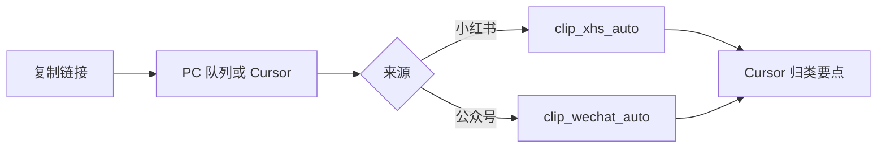

# 3.2 社交内容剪藏：公众号与小红书

> 在 [[3.0 Workflow ：AI 原生科研工作流架构]] 中，**PDF/正式文献** 走 Zotero（[[3.1 Workflow ：Zotero+Obsidian 文献由进到出全流程]]）；**公众号、小红书** 走 `Clippings/` + **Cursor**。
>
> **索引页**：[[Clippings/00_Clippings_MOC]]  
> **脚本说明**：[[0 工作流/scripts/README-clippings]]  
> **Cursor 规则**：`.cursor/rules/xhs-clipping.mdc` · `.cursor/rules/wechat-clipping.mdc`

---

## 一、一次性配置

### 小红书 Cookie

小红书抓取需要登录态，**约 2 分钟做一次**；过期后重做即可。

1. Chrome 打开 [xiaohongshu.com](https://www.xiaohongshu.com) 并登录。
2. **F12** → **控制台** → 粘贴 `0 工作流/scripts/xhs-export-cookies.js` 全部内容 → 回车。
3. 将复制结果保存为 **`0 工作流/scripts/xhs-cookies.json`**（勿提交 Git）。
4. 在 Cookie 列表中另复制 **`web_session`** 的「值」，追加进该 JSON（HttpOnly，控制台脚本导不出此项）：

```json
{
  "name": "web_session",
  "value": "你的值",
  "domain": ".xiaohongshu.com"
}
```

5. 首次抓取前：`pip install requests`；视频转写另需 `faster-whisper` 与 ffmpeg（见 §二）。

### 公众号

**无需 Cookie**。依赖 `requests`（与小红书共用 Python 环境）。若微信返回「环境异常」，在微信内打开后复制全文，或稍后重试。

---

## 二、日常流程：单篇剪藏



| 步骤 | 小红书 | 公众号 |
|------|--------|--------|
| 1 | **分享 → 复制链接**（或分享全文） | 复制 `mp.weixin.qq.com/s/...` 链接 |
| 2a | **批量**：丢进 PC 队列（§四） | 同上（队列自动识别来源） |
| 2b | **单篇**：Cursor「剪藏」或 `Clip-Xhs-Auto.ps1` | Cursor「公众号剪藏」或 `Clip-WeChat-Auto.ps1` |
| 3 | 图文 / 视频 | 正文 + 配图；要点 **6～8 条**（`wechat-clipping.mdc`） |

**笔记结构（小红书）：**

| 类型 | `social`（默认） | `radiology`（阅片学习） |
|------|------------------|-------------------------|
| **图文** | 正文 + 配图本地化；要点 **6～8 条** | 同左 |
| **视频** | 要点 **8～12 条** + **内容纪要**；`转写·原文` 折叠；**不存 mp4** | 同上 + 本地 **`_assets/*.mp4`**；默认 `project: [[临床医学知识库]]` |

**原则：** 凡含 **`转写·原文`**，必须写 **`## 内容纪要`**（去口语重写，勿照抄 Whisper）。日常只看 **要点 + 内容纪要**。

**本机命令（公众号）：**

```powershell
cd "e:\Obisidian\MyObisidian\0 工作流\scripts"
.\Clip-WeChat-Auto.ps1 "粘贴公众号链接"
```

**本机命令（小红书）：**

```powershell
cd "e:\Obisidian\MyObisidian\0 工作流\scripts"
.\Clip-Xhs-Auto.ps1 "粘贴分享全文"
.\Clip-Xhs-Auto.ps1 "粘贴分享全文" -Mode radiology   # 影像阅片
```

**视频转写（一次性，仅小红书）：** `pip install faster-whisper`；`winget install Gyan.FFmpeg`。首次拉模型可设 `HF_ENDPOINT=https://hf-mirror.com`。

**输出：** 小红书 → `Clippings/Xiaohongshu/_Inbox/`；公众号 → `Clippings/WeChat/_Inbox/`；归类后可移入各平台 `<博主名>/` 子夹（§三）。

---

## 三、Vault 目录

```text
Clippings/
├── 00_Clippings_MOC.md
├── Xiaohongshu/
│   ├── _Inbox/              ← 抓取落地（可再移到博主夹）
│   ├── _assets/             ← 配图、radiology 的 mp4
│   └── <博主名>/            ← 系统性资料（索引 + 清单 + 已剪藏笔记）
│       ├── 00索引 …md
│       ├── …list.md         ← 自订待扒清单（如启动阶段）
│       └── 2026-… 单篇.md
├── WeChat/
│   ├── _Inbox/              ← 公众号抓取落地
│   ├── _assets/             ← 配图
│   └── <公众号名>/          ← 可选归类子夹
├── _Inbox/_xhs_queue/       ← PC 队列（.txt）
└── _Processed/              ← 可选归档
```

### Frontmatter 约定

| 字段 | 说明 |
|------|------|
| `source` | `xiaohongshu` / `wechat` / `web` |
| `status` | `inbox` → `classified` → `archived` |
| `tags` | ≤3 |
| `project` | 0～2 个 wiki 链接 |
| `ai_summary` | 一句话可检索结论 |
| `action` | `read_later` / `link_to_zotero` / `discard` |
| `note_type` | `normal` / `video` |
| `video_policy` | `transcript_only`（默认）/ `archive` |

---

## 四、博主系统性资料（已定稿）

> **不再做** 爬虫批量、星标零操作、公众号全量等自动化。够用路径：**博主自出目录 → 自建清单 → 家里逐条复制链接 → PC 一键入库 → 文件夹级 AI 提问**。

### 4.1 流程（以 [[Clippings/Xiaohongshu/香蕉妈妈/00索引 英语启蒙干货笔记汇总-透彻了解底层逻辑]] 为例）

| 步 | 做法 |
|----|------|
| 1 | 剪藏博主 **总目录帖**（多为多图思维导图）；Cursor **配图 OCR** 进 `## 配图目录`，得到可搜视频标题列表 |
| 2 | 按自家情况写 **`…list.md`**（优先级、已扒勾选），如 [[Clippings/Xiaohongshu/香蕉妈妈/启动阶段扒视频list]] |
| 3 | 家里刷小红书：对清单上每一条 **分享 → 复制链接** |
| 4 | **PC 入库**：见 §4.2（队列）或 §二 `Clip-Xhs-Auto` / Cursor「剪藏」 |
| 5 | 笔记进 **`Xiaohongshu/<博主名>/`**；完成后对 `@Clippings/Xiaohongshu/香蕉妈妈` 等文件夹提问，无需再刷视频 |

### 4.2 PC 队列（家里批量推荐）

vault 在坚果云时，手机把分享全文写入队列，PC 轮询自动 `clip_xhs_auto`（无需每条开 Cursor）。

**一次性：**

```powershell
cd "e:\Obisidian\MyObisidian\0 工作流\scripts"
.\Start-XhsClipService.ps1 -QueueOnly
```

队列目录：`Clippings/_Inbox/_xhs_queue/`。成功 → `_done/`；失败 → `_failed/` + `.log`。

**手机侧（二选一，配好一种即可）：**

- **坚果云 WebDAV**：分享全文 PUT 到 `_xhs_queue/<时间戳>.txt`（应用密码、路径见 [[0 工作流/工具箱/归档/Ongoing_小红书手机剪藏-进度纪要-2026-05-18]]，iOS 快捷指令可按需补完）。
- **家里 Wi‑Fi POST**：PC `Start-XhsClipService.ps1`（8765），快捷指令 POST `http://<PC局域网IP>:8765/clip`，表单 `text`=剪贴板。

**手动跑一轮（服务未开时）：** `.\Process-XhsClipQueue.ps1`

**故障：** Cookie 过期 → 重做 §一；无 md → 查 `_xhs_queue/_failed/`。  
**转写失败**（笔记里写「未找到 ffmpeg」）：多为 **开机自启的剪藏服务** 启动时 PATH 里还没有 ffmpeg；重装/更新 ffmpeg 后 **重启 `XhsClipService` 计划任务**，并对已入库笔记运行 `python retranscribe_xhs_notes.py`（见 `0 工作流/scripts/`）。

### 4.3 归类约定

- 索引帖、清单：留在博主文件夹根目录。
- 单篇：抓取后从 `_Inbox` **移到** `Xiaohongshu/<博主名>/`，由 Cursor 写厚要点 / 内容纪要（`xhs-clipping.mdc`）。
- 可选 `xhs-llm.json` 自动 enrich；未配置时由 Cursor 手写要点即可。

---

## 五、脚本清单（`0 工作流/scripts/`）

| 文件 | 用途 |
|------|------|
| `clip_xhs_auto.py` | 抓取 → 转写（可选）→ 写 md |
| `Clip-Xhs-Auto.ps1` | PowerShell 入口（`-Mode social\|radiology`） |
| `fetch_xhs_note.py` | 页面解析、配图下载 |
| `transcribe_xhs_video.py` | 视频转写（social 默认不保留 mp4） |
| `xhs_clip_service.py` | 队列轮询 / POST 接收 |
| `Start-XhsClipService.ps1` | 启动服务（`-QueueOnly` 仅队列） |
| `enrich_xhs_clipping.py` | 可选 Gemini 要点（`xhs-llm.json`） |
| `xhs-export-cookies.js` | 导出 Cookie |
| `xhs-cookies.json` | 本地 Cookie（gitignore） |

---

## 六、能力边界（刻意不做）

| 需求 | 决定 |
|------|------|
| 指定博主爬虫 / RSS 全量 | **不做**；用手动清单 + PC 队列 |
| 星标后零操作 | **不做** |
| 手机端未完成的一键方案 | **不阻塞**；家里复制链接 + PC 队列已够用 |
| 公众号 / B 站 / 网页 | 公众号 **已定稿**（`clip_wechat_auto`）；B 站 / 通用网页仍待接入 |
| 剪藏后自动迁入 `7 可复用知识库/` | **手动**移动或另定规则 |

### 已验证、保留组件

`clip_xhs_auto` + Cookie + Cursor（`xhs-clipping.mdc`）；`clip_wechat_auto` + Cursor（`wechat-clipping.mdc`）；多图本地化；视频 social=仅转写 / radiology=存 mp4。

### 已放弃路径（勿复活）

Jina Reader 抓小红书；Obsidian Copilot 自动改笔记；Templater + `clip_from_url.js`；旧 `classify_clipping.py` 日常链。

---

## 七、与 Zotero 分工

| 类型 | 入口 |
|------|------|
| PDF 论文 | Zotero |
| 小红书 / 公众号观点 | `Clippings/` + Cursor |

---

## 变更记录

| 日期 | 说明 |
|------|------|
| 2026-06-03 | **公众号自动化**：`clip_wechat_auto` + `fetch_wechat_article` + `Clip-WeChat-Auto.ps1`；队列自动路由；`wechat-clipping.mdc` |
| 2026-05-18 | **定稿修剪**：§四 博主系统性资料（目录+清单+PC 队列）；删 §五～§七 长篇对照/坚果云教程/Tailscale；明确不做批量爬虫与手机零操作 |
| 2026-05-18 | 香蕉妈妈试点：索引 OCR + `启动阶段扒视频list` + 博主子目录 |
| 2026-05-18 | 坚果云队列、Gemini enrich（详见 [[0 工作流/工具箱/归档/Ongoing_小红书手机剪藏-进度纪要-2026-05-18]]，非日常必读） |
| 2026-05-17 | Cursor + clip_xhs_auto 小红书单篇全流程；视频分层要点+内容纪要 |
