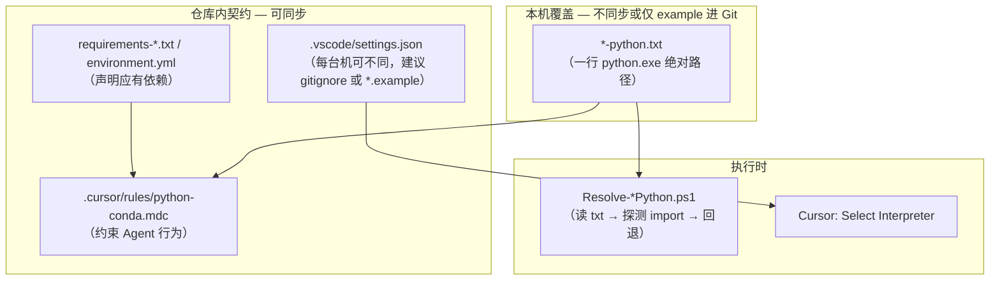
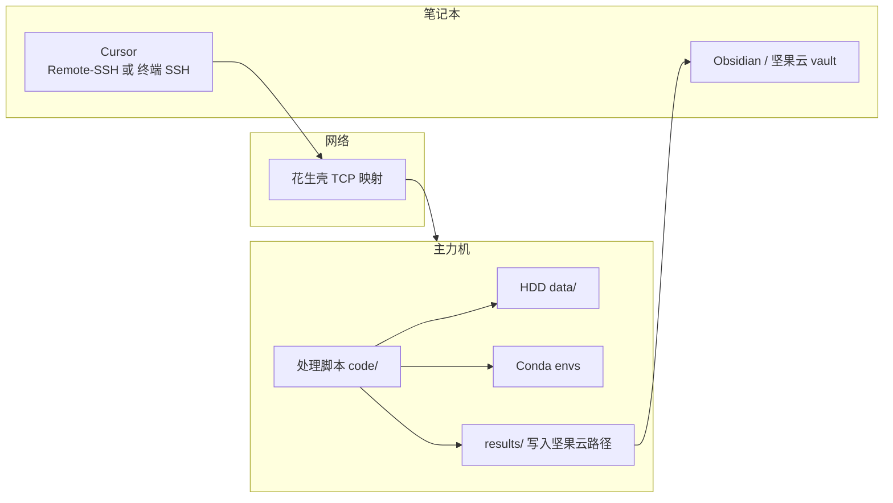

# 3.3 Cursor 与 Conda/Python 环境约定

> **状态：§七 远程 SSH 已定稿落地**（2026-05-30：花生壳 + OpenSSH + 双机 SSH 验证通过；路径契约 `paths-home.example.json`、规则 `remote-compute.mdc` / `python-conda.mdc` 已写入）。§五–§六（conda 全机索引、3.2 小红书 env）仍待主力机逐项完善。
>
> 归属：[[3.0 Workflow ：AI 原生科研工作流架构]] 的基础设施层（与 [[3.1 Workflow ：Zotero+Obsidian 文献由进到出全流程]]、[[3.2 Workflow ：社交内容剪藏（公众号与小红书）]] 并列）。
>
> **与 3.2 的关系**：小红书剪藏（3.2）的 Python 依赖与环境绑定，**推迟到主力机**；本 workflow 定好通用约定后，再在 3.2 / `scripts/` 上挂具体配置（见 §六）。
>
> **与远程计算的关系**：影像等大体积 **Data** 仅放主力机机械硬盘；**笔记本不另配一套 conda/数据**，通过 **SSH 连回家里的电脑** 跑处理，**Results** 写入坚果云同步目录，在笔记本 Obsidian / Cursor 中查看（见 §七）。**落地手册**：[[0 工作流/scripts/落地手册-Cursor远程主力机]] · **脚本速查**：[[0 工作流/scripts/README-remote-ssh]]。

---

## 一、要解决的问题

| 现象 | 原因 |
|------|------|
| Cursor Agent 经常 `pip install` 重复装包 | 未绑定工作区解释器，终端默认 `python` 与 conda 环境不一致 |
| 「找不到模块」但本机其实有 | 包装在**别的** conda env 里；AI 未先 `import` 验证 |
| 双机路径不一致 | 笔记本与主力机盘符、conda 安装路径不同，不能把绝对路径写死在仓库里（需「每台机一份本地覆盖」） |
| 笔记本不想再维护多套 conda + 拷影像数据 | 数据在主力机 HDD；处理应在**远端**完成，笔记本只看同步后的结果 |

**目标**：让人、IDE、PowerShell 脚本、Cursor 规则共用**同一套约定**——先指定环境，再谈装包。  
**延伸目标（§七）**：笔记本以 **SSH 远程** 使用主力机的环境与数据，**不在笔记本上复制** 影像库与 conda 环境。

---

## 二、设计原则（四层）



| 层级 | 文件 / 操作 | 作用 |
|------|-------------|------|
| **IDE** | `.vscode/settings.json` → `python.defaultInterpreterPath` | Pylance、集成终端、与 Cursor 索引对齐 |
| **本机路径** | 如 `0 工作流/scripts/xhs-python.txt`（一行） | 脚本与 Agent 在**不依赖**全局 `python` 时可复用 |
| **依赖契约** | `requirements-*.txt` 或 `environment.yml` | 告诉 AI「应已安装什么」，减少盲目 `pip install` |
| **Agent 规则** | `.cursor/rules/python-conda.mdc` | 强制：先指定解释器 → `import` 探测 → 再决定是否安装 |

**禁止**：在未读当前解释器路径前，向「系统默认 python」执行 `pip install`。

---

## 三、Conda 多环境策略

### 3.1 环境分类（建议）

| 类型 | 命名示例 | 用途 |
|------|----------|------|
| **Vault 工具环境** | `xhs_clip`、`vault_tools` | Obsidian vault 内 `0 工作流/scripts/` 等自动化脚本 |
| **科研项目环境** | `nilearn`、`opennft`、`HSQC`… | 各 Git 子项目 / `5 分支项目/`，按课题保留 |
| **临时试验** | `pilot_xxx` | 探索完可删或合并进主线 env |

原则：**一个「需要跑脚本的子系统」对应一个 env**，不在科研 env 里混装剪藏/爬虫类依赖。

### 3.2 环境索引（待填）

> 在主力机上执行 `conda env list` 后，把**本机**环境名与用途填进下表（便于 AI 与人类查表，避免装错环境）。

| 环境名 | 主要用途 | 关键包 | 备注 |
|--------|----------|--------|------|
| `base` | Anaconda 默认 | | `D:\ProgramData\Anaconda3` |
| `TabPFN` | **1a-2a** 海马疗效预测 | TabPFN | 主力机已存在 |
| `TabPFN39` / `TabPFNv2` / `TabPFNv3` | TabPFN 版本试验 | | 按需 |
| `openNFT` | **RTNF** 实时 fMRI | openNFT | `E:\recentwork-RTNF`、`E:\RT\OpenNFT` |
| `bids` | BIDS 数据整理 | pybids | |
| `BrainNote` | 脑笔记相关 | | |
| `HSQC_visualize` | HSQC 可视化 | | 与 `E:\HSQC` 相关 |
| `vMRE` | vMRE 项目 | | `E:\recentwork-vMRE` |
| *（待建）`xhs_clip`* | 3.2 小红书剪藏 | `requests`, `faster-whisper` | 见 §六 |

### 3.3 双机（坚果云 vault + 本机 conda）

- **Vault 笔记与脚本**：坚果云同步；**conda 环境不随 vault 同步**。
- **默认策略（科研影像）**：**仅在主力机** 维护 conda；笔记本通过 §七 SSH 远程使用，**不在笔记本另配** `nilearn` 等重型环境（vault 轻量脚本如 3.2 可例外，仍建议在主力机完成）。
- **路径覆盖文件**（如 `xhs-python.txt`）：建议 **`.gitignore`**，仓库只保留 `xhs-python.txt.example`；每台机复制为本地 `xhs-python.txt` 并写入本机 `python.exe` 路径。
- **`.vscode/settings.json`**：若两台路径不同，同样用 `settings.json.example` + 本地 `settings.json`（或每台机在 Cursor 里选一次解释器后由 IDE 写入）。**Remote-SSH 打开主力机工作区时**，解释器应指向**远端** conda，而非笔记本本地。

---

## 四、标准落地步骤（任意 Python 子项目通用）

在主力机上对**每一个**需要 Cursor 经常改动的脚本目录，重复：

1. **选定或新建 conda 环境**  
   `conda create -n <env> python=3.11 -y` → `conda activate <env>` → 按 `requirements-*.txt` 安装。

2. **工作区解释器**  
   `Ctrl+Shift+P` → **Python: Select Interpreter** → 选该 env。  
   确认生成/更新 `.vscode/settings.json`（可与 `python.condaPath` 指向 `miniconda3\Scripts\conda.exe`）。

3. **本机路径文件（可选，供 PS1 脚本）**  
   在脚本目录建 `<project>-python.txt`，内容一行：  
   `C:\Users\<用户>\miniconda3\envs\<env>\python.exe`

4. **依赖清单**  
   `pip freeze` 或手写 `requirements-<project>.txt` / `environment.yml` 放入同目录或项目根。

5. **Cursor 规则**  
   新建或扩展 `.cursor/rules/python-conda.mdc`（`globs` 含 `**/*.py`）：  
   - 读 `settings.json` 与 `*-python.txt`  
   - 用指定解释器执行 `python -c "import …"`  
   - 仅当确认缺失且契约文件中有记录时，才 `pip install` 到**该 env**

6. **验证**  
   ```powershell
   & "C:\...\envs\<env>\python.exe" -c "import requests; print('ok')"
   ```  
   在 Cursor Agent 对话中试跑一次「只 import、不 install」。

---

## 五、主力机执行清单（待办）

> 在**家里主力机**打开本库后，逐项勾选并更新文首「变更记录」。

- [ ] 确认 Miniconda/Anaconda 路径与 `conda env list` 输出（主力机已确认为 `D:\ProgramData\Anaconda3`，§3.2 已填）
- [x] 填写 §3.2 环境索引表（2026-05-30 自主力机 `conda env list`）
- [ ] 创建 `.vscode/settings.json`（或 `settings.json.example` + 本地覆盖策略）
- [x] 编写 `.cursor/rules/python-conda.mdc`（2026-05-30）
- [x] 路径契约：`0 工作流/scripts/paths-home.example.json` + `paths-home.local.json.example`
- [ ] 决定 `.vscode/settings.json`、`*-python.txt` 是否进 Git（建议 example 进库、实文件 gitignore）
- [ ] **§六 小红书试点**（依赖 3.3 通用约定）
- [x] **§七 远程 SSH 计算**（2026-05-30 定稿）
- [x] 在 [[3.0 Workflow ：AI 原生科研工作流架构]] 增加指向 §七 的链接（2026-05-30）

**当前笔记本**：仅维护本文档；**不**创建科研 conda env、**不**拷贝 HDD 影像库、**不**改 3.2 脚本运行环境。

---

## 六、试点：3.2 小红书剪藏（推迟，待 3.3 定稿后）

> **不在笔记本上实施**；3.2 主流程见 [[3.2 Workflow ：社交内容剪藏（公众号与小红书）]]。

| 项 | 计划 | 状态 |
|----|------|------|
| 专用 env | 建议新建 `xhs_clip`（或与 `vault_tools` 合并命名） | 待主力机 |
| 依赖 | `requests`, `faster-whisper`；系统级 `ffmpeg`（`winget install Gyan.FFmpeg`） | 待主力机 |
| 路径文件 | `0 工作流/scripts/xhs-python.txt`（已有 `Resolve-XhsPython.ps1` 会读取） | 待创建 |
| 示例进库 | `xhs-python.txt.example` | 待创建 |
| 依赖清单 | `0 工作流/scripts/requirements-xhs.txt` | 待创建 |
| Cursor 规则 | 更新 `xhs-clipping.mdc`：用 `Clip-Xhs-Auto.ps1` / `Resolve-XhsPython.ps1`，禁止裸 `python` | 待主力机 |
| 验证 | `.\Clip-Xhs-Auto.ps1` 测试一篇分享 | 待主力机 |

**说明**：仓库内 `Resolve-XhsPython.ps1` 已支持 `xhs-python.txt` 覆盖；当前脚本仍含旧路径 `D:\ProgramData\Anaconda3\...` 作为候选，主力机落地时应改为以 **miniconda3 + xhs-python.txt** 为主（待完善时改脚本）。

---

## 七、远程计算：笔记本 SSH → 主力机处理 → 坚果云呈现

> **状态：已定稿**（2026-05-30）。与 [[3.0 Workflow ：AI 原生科研工作流架构]] §1 一致：**Data 在主力机 HDD**，**Notes / Results 走坚果云**，**Code 走 Git**。  
> **操作手册**：[[0 工作流/scripts/落地手册-Cursor远程主力机]] · **路径表**：[[0 工作流/scripts/paths-home.example.json]]

### 7.1 需求与分工

| 角色 | 主力机（家里） | 笔记本（外出） |
|------|----------------|----------------|
| **原始影像 Data** | 机械硬盘 / 本地 `data/`（软链接进项目） | **不存放、不同步** |
| **Conda 环境** | 唯一维护点（`nilearn`、`opennft` 等） | **不另配一套**（避免版本漂移与磁盘占用） |
| **计算** | 实际跑 Python / SPM / FSL / 自研脚本 | 通过 **SSH** 触发或 **Cursor Remote-SSH** 在远端编辑+运行 |
| **笔记与轻量结果** | 写入坚果云同步目录内的 vault / `results/` | 坚果云同步后 **Obsidian 阅读**、Cursor 改 md / 看图表 |
| **代码** | Git clone；远端执行 | 可本地改 md，**提交 Git**；跑数仍 SSH 回主力机 |

**原则**：笔记本是「控制台 + 阅读端」，不是第二套计算节点。

### 7.2 目标架构（草案）



1. 笔记本 **SSH** 登录主力机（建议 **密钥登录**，禁用弱口令）。
2. 在主力机上 `cd` 到 Git 项目目录，`conda activate <env>`，读写 **HDD 上的 `data/`**。
3. 脚本将 **图表、表格、摘要统计、轻量导出** 写到 **坚果云已同步** 的 `results/` 或 vault 内约定目录（**勿**把原始 NIfTI/DICOM 写入坚果云）。
4. 笔记本 Obsidian 打开同一 vault，自动看到新结果；需要改代码时 Git pull / push 或 Remote-SSH 直连主力机工作区。

### 7.3 与 3.0 资产类型的对应

| 3.0 资产 | 远程方案下的约定 |
|----------|------------------|
| **Data** | 仅主力机 HDD；项目内用**相对路径 + 软链接**；笔记本 SSH 后仍用**主力机绝对路径** |
| **Code** | Git 为准；远端与本地通过 commit 对齐，避免坚果云同步 `.py` 冲突（大库代码优先 Git） |
| **Results** | 必须落在坚果云同步盘内；体积可控（png/csv/json/summary nii 等需单独约定上限） |
| **Notes** | vault 已在坚果云；可在笔记本写实验日志，**跑数命令**记在笔记里但**执行在远端** |

### 7.4 选型与约定（已定稿）

| 主题 | 决定 | 状态 |
|------|------|------|
| **外网连回家** | **花生壳 TCP + OpenSSH**（`xi41364611.wicp.vip:24109`） | **已落地** |
| **主力机常开** | 插电不睡眠（`Configure-HomePowerNoSleep.ps1`）；外出前确认花生壳在线 | **已配置** |
| **Cursor 用法** | **Remote-SSH** → `home-pc` → 开主力机 code 目录 | **SSH 已验证** |
| **路径契约** | `paths-home.example.json`（vault / conda / 项目 / HDD） | **已写** |
| **长任务** | `Start-RemoteBackgroundJob.ps1`（Remote 终端后台 + 日志） | **已写** |
| **安全** | ed25519、`PasswordAuthentication no`、`administrators_authorized_keys` | **已落地** |
| **Agent 规则** | `remote-compute.mdc` + `python-conda.mdc` | **已写** |

### 7.5 双机信息（2026-05-30）

| | 主力机 | 笔记本（外出） |
|--|--------|----------------|
| 主机名 | `LAPTOP-HMRRC11` | `lilianna-usus` |
| Windows 用户 | `HMRRC` | `41516` |
| Vault 本地路径 | `E:\Obisidian\MyObisidian` | `C:\Users\41516\Nutstore\1\MyObisidian` |
| Conda | `D:\ProgramData\Anaconda3` | **不维护科研 env** |
| HDD Data | `D:\data\` | 不同步 |
| SSH | `sshd :22` + 花生壳 | `~/.ssh/config` → `home-pc` |

### 7.6 落地清单

**笔记本侧 — 已完成**

- [x] `id_ed25519_home` + `~/.ssh/config`（`home-pc`）
- [x] `Test-HomeSshConnection.ps1` 通过（2026-05-30）
- [x] 脚本套件 + `Run-LaptopRemoteLanding.ps1`
- [x] `README-remote-ssh.md`、`落地手册-Cursor远程主力机.md`

**主力机侧 — 已完成**

- [x] `Run-HomeRemoteLanding.ps1`（OpenSSH + 公钥 + 免睡眠）
- [x] 追加笔记本公钥
- [x] 花生壳 TCP 映射在线

**两端 — 日常使用（首次 Cursor Remote 后勾选）**

- [ ] Cursor Remote-SSH → `home-pc` → cursor-server 安装完成
- [ ] 打开目标项目（见 `paths-home.example.json` → `projects`）
- [ ] **Python: Select Interpreter** → 远端 Conda（如 `TabPFN`）
- [ ] `Invoke-RemoteProjectCheck.ps1 -ProjectPath <code根>`
- [ ] 试跑：读 HDD 数据 → 输出 png/csv 到 vault `.../results/` → 笔记本 Obsidian 可见

### 7.7 日常用法

```text
外出改代码/跑数：Cursor → Remote-SSH → home-pc → conda activate → 跑脚本
看结果/写笔记：  笔记本 Obsidian（坚果云 vault 自动同步 results/）
同步代码：        Git commit/push（勿依赖坚果云同步 .py）
长任务：          Start-RemoteBackgroundJob.ps1 -CondaEnv TabPFN -ScriptPath ...
```

### 7.8 明确不做

- 不把完整影像库通过坚果云同步到笔记本。
- 不在笔记本为 `nilearn` / `opennft` 等再建一套「镜像环境」（除非某脚本必须离线演示且与 §七 冲突——届时单独论证）。
- 不让 Cursor Agent 在**未 Remote** 的笔记本终端对 HDD 影像路径执行重型处理（`remote-compute.mdc` 已约束）。

---

## 八、科研项目子目录（待扩展）

按 [[3.0 Workflow ：AI 原生科研工作流架构]] §2 的 Git 子项目结构，每个 `Project_Name/code/` 可另配：

| 文件 | 说明 |
|------|------|
| `environment.yml` | `conda env create -f environment.yml` |
| `python.env` 或 `.python-path` | 一行解释器路径（可选，供 Cursor 规则优先于 vault 默认） |
| 子目录 `.vscode/settings.json` | 用 Cursor 多根工作区打开子项目时生效 |

本节细则 **待完善**（等第一个科研子项目在 Cursor 里频繁改代码时再写）。远程场景下，**`code/` 在主力机执行**，笔记本仅 Git 同步与 §七 SSH。

---

## 九、变更记录

| 日期 | 机器 | 内容 |
|------|------|------|
| 2026-05-19 | 笔记本 | 初稿：问题定义、四层约定、双机策略、3.2 试点推迟至主力机；状态 **待完善** |
| 2026-05-19 | 笔记本 | 新增 §七：笔记本 SSH 主力机处理、Data 留 HDD、Results 经坚果云呈现；笔记本不另配 conda/影像库 |
| 2026-05-30 | 笔记本（41516 路径草案） | §七 落地启动：脚本套件、`remote-compute.mdc`；主力机待 OpenSSH + 花生壳 |
| 2026-05-30 | 笔记本 `LAPTOP-HMRRC11` | 本机生成 `id_ed25519_home` 并更新 vault 公钥；`home-pc` 待花生壳参数 |
| 2026-05-30 | 主力机 `LAPTOP-HMRRC11` | `Run-HomeRemoteLanding.ps1` 完成；花生壳 `xi41364611.wicp.vip:24109`→`:22`（动态端口） |
| 2026-05-30 | 主力机 | 追加外出笔记本公钥（`id_ed25519_home.pub` 坚果云同步版）至 `administrators_authorized_keys` |
| 2026-05-30 | 笔记本 `lilianna-usus` | `Test-HomeSshConnection.ps1` 通过；SSH → `LAPTOP-HMRRC11` / `HMRRC` |
| 2026-05-30 | vault | §七 工作流定稿：`paths-home.example.json`、`python-conda.mdc`、`Start-RemoteBackgroundJob.ps1`；§3.2 填主力机 conda 索引 |
