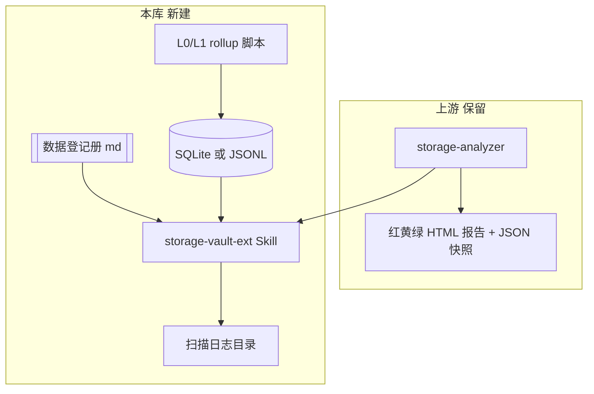

# 磁盘索引与清理 · 规划（新开对话入口）

> **用途**：本页汇总 2026-06-06 对话结论，供新开 Agent 对话时 `@` 本文件继续。  
> **当前状态**：仅规划，**尚未实施**。  
> **背景剪藏**：[[2026-06-03 清理垃圾.Skill]]（上游 [khazix-skills/storage-analyzer](https://github.com/KKKKhazix/khazix-skills/tree/main/storage-analyzer)）

---

## 一、问题定义

不只是「清垃圾」，而是 **让多年、多来源、身份可能不明确的数据在需要时能以较低时间和 token 成本被找到 → 逐步识别 → 安全归档/清理 → 持续更新索引**。

> **核心诉求**：建立接近完整的磁盘搜索与发现能力。清理磁盘是索引和识别完成后的附带收益，不以近期活跃项目作为唯一索引范围。

| 痛点 | 说明 |
|------|------|
| 盘多、数据大 | 9 个盘符；J 盘 ~3.7TB 已用 ~3.3TB |
| 找数据贵 | 多年历史数据来源复杂；每次让 Agent 全库递归扫盘，慢且耗 token |
| 未知数据多 | 部分目录个人也暂不清楚来源，但保险起见应保管，并保证未来可再次找到 |
| 清理有风险 | 科研影像（DICOM/NIfTI 等）不能当普通缓存删 |
| 原 Skill 边界 | `storage-analyzer` 擅长红黄绿+安全删除，**不**提供可持续查询的语义目录 |

---

## 二、当前磁盘快照（2026-06-06 只读）

| 盘 | 标签 | 总容量 | 已用 | 剩余 | 备注 |
|----|------|-------:|-----:|-----:|------|
| **C** | OS | 332 GB | 263 GB | **69 GB** | 系统盘偏紧，Dev/缓存敏感 |
| **I** | data6 | 472 GB | 373 GB | **99 GB** | 将满 |
| **J** | data7 | **3726 GB** | **3329 GB** | 397 GB | 主要「吓人」来源 |
| **H** | data2 | 1276 GB | 615 GB | 661 GB | 余量较大，可作冷归档目标 |
| **G** | data1 | 1024 GB | 346 GB | 679 GB | 同上 |
| D/E/F/L | 各 200～223 GB | — | 82～144 GB | 79～114 GB | 中等占用 |

**盘符角色（草案，实施前需用户确认）**

| 盘 | 角色 |
|----|------|
| C | 系统 + Dev 环境 |
| D | 软件安装 |
| E/F/L | 通用数据 |
| G/H | 冷归档 / 有余量 |
| I/J | 主力科研/影像数据（优先索引与归档） |

---

## 三、核心结论（对话共识）

### 3.1 顺序：索引优先，清理其次；清理后 **增量** 更新


- **不要**每次清理后对整个 J 盘全量重扫；只 patch 受影响路径。
- C 盘救急可与 J 盘 L1 索引 **并行**，不必等 J 索引完成。

### 3.2 索引分两层（filesystem + 语义）

| 类型 | 回答什么 | 存什么 |
|------|----------|--------|
| **Filesystem 清单** | 哪盘、哪目录、多大、什么扩展名 | SQLite / JSONL + 查询脚本 |
| **Research 资产目录** | 属于哪个项目、能否归档、最后验证日 | vault **数据登记册**（Markdown/YAML） |

只建 filesystem 清单 → Agent 仍猜不出「是不是 RTNF 那批被试」。  
只做登记册不扫盘 → 路径 rapidly 过期。

### 3.3 分层索引 L0–L3（全盘元数据覆盖，按需语义深化）

| 层 | 内容 | 成本 | 用途 |
|----|------|------|------|
| **L0** | 盘符摘要 | 秒级 | 哪盘快满 |
| **L1** | 已知根目录下 2～3 层 rollup | 分钟级 | J 盘大户在哪 |
| **L2a** | 所有数据盘的文件元数据索引：路径、文件名、扩展名、大小、时间 | 首次全量、后续增量 | 低成本查具体文件、被试编号、日期和历史目录 |
| **L2b** | 按需读取文件头、压缩包目录或少量内容 | 针对性执行 | 辅助识别名称不明确的未知数据 |
| **L3** | Obsidian **数据登记册**（人工确认的语义） | 渐进维护 | 「这批数据是什么、是否唯一副本、能否动」 |

**建议建立全盘文件元数据索引，但不建议由 Agent 每次递归全盘，也不建议起步读取全部文件内容。**

- 优先复用 Windows Everything 等专用索引工具完成 L2a；必要时再用 SQLite 保存目录画像和补充字段。
- 全量索引回答“在哪里”；目录画像和 L2b 回答“可能是什么”；L3 登记册记录人工确认后的权威结论。
- 未知数据统一标记为 `unknown / 待识别`，默认保留，不因名称陌生、长期未使用或无法归属项目而进入删除候选。

### 3.4 Token 怎么才省

| ✅ 省 | ❌ 不省 |
|-------|--------|
| Agent 查询 Everything / SQLite，只拿 Top N 结果 | 每次 `Get-ChildItem -Recurse` 全库 |
| 登记册 + SQL 小结果集 | 把巨大索引整份 md 塞进对话 |
| 索引 miss 时再 targeted 扫盘（须用户确认） | 假设索引永远正确、从不验证 |

思路同 vault「邮件队列索引、正文在 drop」：**索引在 LLM 外，Agent 只消费查询结果**。

---

## 四、推荐方案：B（分层索引 + 登记册）

**不替换**上游 `storage-analyzer`；在其上叠加 **vault 本地 overlay**。

### 架构



### 与现有系统分工

| 已有 | 管什么 | 本规划补什么 |
|------|--------|--------------|
| Obsidian 链接/graph | 知识、workflow | 不管 J 盘 raw 数据 |
| Zotero | 文献 | 不管影像原始数据 |
| storage-analyzer JSON | 一次性空间快照 | 可持续查询 + 增量 |
| 项目页 / ResearchTrack | 项目语义 | 常缺「数据实际路径」→ **登记册** |

### 未采纳方案（备忘）

| 方案 | 为何不首选 |
|------|------------|
| A Agent 自建全库 file-level 索引并反复全量扫描 | J 盘 3.3TB 过重；易 stale；浪费时间和 token |
| C 仅 Everything + 薄 overlay | 能按名称找文件，但缺目录画像和项目语义；仍要 L2b/L3 |

Everything 作为 **L2a 全盘文件元数据索引的首选底座**；SQLite 主要保存目录画像、识别状态、审计信息和 Everything 不便承载的补充字段。

---

## 五、分阶段实施蓝图（待新对话执行）

### Phase 0 · 基线（只读）

- [ ] 用户确认盘符角色表（§二）
- [ ] L0 已有；补 **C / J / I** 的 **L1 rollup**（各盘 Top 15～20 一级/二级目录）
- [ ] 确认各盘介质类型、健康状态、是否为唯一副本、是否已有备份；有空余空间不等于可直接作为冷归档盘
- [ ] 产出落盘：`0 工作流/工具箱/磁盘索引/`（目录尚未创建）

### Phase 1 · 全盘可发现性（L2a）

- [ ] 用 Everything 等专用工具覆盖所有数据盘的文件元数据，不读取文件正文
- [ ] 验证典型查询：项目名、被试编号、年份、扩展名、文件大小、目录路径
- [ ] 查询结果显示 `indexed_at / last_seen`，避免把过期索引当作当前事实
- [ ] 建立低频 L1 全量复核 + 日常增量更新机制；删除或归档前仍实时验证目标路径

### Phase 2 · 目录画像与登记册（L1/L2b/L3）

- [ ] 为大目录生成画像：总大小、文件数、主要扩展名、年份范围、示例文件名、疑似重复关系
- [ ] 定 `数据登记册` 模板字段，例如：  
  `project` · `path` · `内容摘要` · `data_type` · `状态(active/archive-candidate/archived/unknown)` · `source_of_truth` · `backup_count` · `backup_locations` · `sensitivity` · `last_verified` · `verification_method` · `retention_rule` · `owner_decision` · `notes`
- [ ] 先手工确认 **10～20 条**高价值或常用根路径；其他目录允许长期保持 `unknown / 待识别`
- [ ] 登记册建议位置：`7 可复用知识库/` 或 `5 分支项目/` 下独立页（实施时定）

### Phase 3 · 查询与 Skill

- [ ] Everything + 本地 SQLite + `query_data.ps1`（或 `.py`）；JSON/CSV 用于操作前后的审计快照
- [ ] 个人 Skill `storage-vault-ext`（`~/.cursor/skills/` 或 vault `.cursor/skills/`）  
  - 触发：「找数据」「某项目数据在哪」「盘空间」「归档候选」  
  - 流程：登记册 → Everything / SQL → 必要时 targeted 扫盘或 L2b 识别  
  - 清理：仍调用 storage-analyzer；禁止无索引全库递归（除非 miss + 用户确认）
- [ ] Agent 规则（可选）：`.cursor/rules/` 或 `AGENTS.md` 一小节

### Phase 4 · 清理与归档

- [ ] C 盘：storage-analyzer **绿灯**快赢
- [ ] J/I：经确认后复制归档到合适介质；H/G 是否适合作为归档目标须先验证
- [ ] 归档严格执行：**复制 → 校验 → 保留观察期 → 用户再次确认 → 删除源文件**
- [ ] 校验至少包括文件数量、总字节数；关键科研数据生成 SHA-256 清单，必要时检查 DICOM/NIfTI 成组完整性
- [ ] 每次操作后 **delta 更新** SQL + 登记册 `last_verified` / `状态`

### Phase 5 · 深度识别（按需）

- [ ] 对需要找回、归档或判断的大目录执行 L2b，读取必要的文件头、压缩包目录或少量内容
- [ ] 科研扩展名、无扩展名文件、压缩包、数据库及分析输出默认 **非绿灯**，最多标「归档候选」

---

## 六、待新对话拍板的 3 个决策

1. **L2a 底座**：优先验证 Everything 是否能稳定覆盖所有数据盘；SQLite 保存补充画像与状态
2. **「找数据」典型问法**（决定目录画像和 L2b 的优先级）——见 §七问卷
3. **登记册放哪**：`7 可复用知识库/数据登记册.md` vs 各项目页分散维护

---

## 七、开新对话时请用户回答

**最常让 Agent「找数据」的是哪一类？**（可多选或排序）

- **A** 科研项目路径（RTNF、眉彡、省自然…）
- **B** 具体文件名 / 被试编号 / 扫描日期
- **C** 来源不明但希望未来可以重新找到的历史数据
- **D** 哪些可以删 / 可以归档
- **E** 以上差不多一样多

**第一优先级？**

- **1** 救急 C + I 腾空间
- **2** 攻坚 J 盘大户 + 归档方案
- **3** 两者都要（先 15 分钟 C+J L1 快扫）

---

## 八、新对话推荐口令

```
@0 工作流/工具箱/磁盘索引与清理-规划.md
按 Phase 0 开始：先只读 L1 rollup C/J/I，不写登记册。
```

或：

```
@0 工作流/工具箱/磁盘索引与清理-规划.md
我先回答 §七：找数据主要是 A，优先级是 3。请定登记册模板并起草 Skill 大纲。
```

---

## 九、归档与删除安全协议

### 9.1 数据分类

| 分类 | 默认动作 |
|------|----------|
| 已确认可再生缓存 | 可列为绿灯候选，删除仍须确认 |
| 可能影响登录、环境或工作状态 | 黄灯，说明影响后由用户拍板 |
| 科研数据、项目数据、唯一副本、未知数据 | 橙灯，只能识别或归档，不得直接删除 |
| 系统文件、未知系统用途、正在使用的数据 | 红灯，禁止触碰 |

### 9.2 删除必要条件

未知数据默认保留。删除非缓存数据前，必须同时满足：

1. 已确认内容与来源；
2. 已确认不是唯一副本；
3. 已确认未来无保留需要；
4. 已生成可审计的待删除清单；
5. 用户针对该清单明确确认。

### 9.3 归档必要条件

- 不使用跨盘直接移动作为默认操作。
- 目标盘必须先确认健康状态、剩余容量、介质角色和备份情况。
- 复制完成后校验文件数量、总字节数和关键文件哈希。
- 校验通过后保留源文件观察期；删除源文件需要用户再次确认。

---

## 十、边界与约束

- 查看磁盘余量、限定深度目录大小、查询已有索引可直接执行。
- 长时间全盘扫描、读取文件内容前先说明范围；任何写入、归档、迁移、删除须用户确认（对齐 `AGENTS.md` 默认边界）。
- **不 fork** khazix-skills；upstream 更新可继续 `git pull`
- 试验阶段文件标 **pilot**；定稿后写入 workflow 并走 `vault-landing-cleanup`
- 本规划 **不是** workflow 定稿；实施满意后再升 `3.x Workflow`

---

## 十一、相关链接

- 剪藏：[[2026-06-03 清理垃圾.Skill]]
- 待玩清单：[[00索引 待玩清单-Cursor-Obsidian-NotebookLM]]（06-03 条目仍可按本规划延伸）
- 协作原则：[[AGENTS.md]] · `.cursor/rules/first-principles.mdc`
