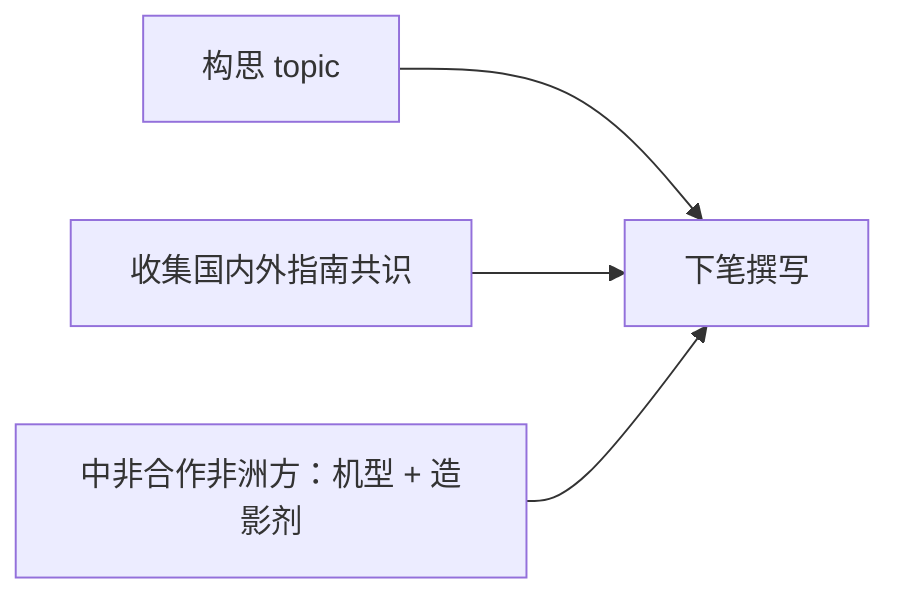

# 会议 · 叶铮（2026-06-02）

> 与 [[2026-05-27 真林院长]] 教学/指南线衔接；跟进见 [[同期项目-下一节点]]。

## 一、教材 · 两本书推进

近期需主动推进的两本（真林会「三本书」中的子集；**整合影像技术学**另走合同流程，不在此列）：

- [ ] **影像技术科研方法** — 填写申报表 + 附录目录
- [ ] **智能三维可视化图像后处理** — 原图像后处理教材修订

> 背景 → [[2026-05-27 真林院长#三、教学|真林会 · 三本书]]；具体分工/截止待与科室对齐。

## 二、指南 / 共识

**阻塞**：**一带一路 · 中非合作**项目的 **非洲方**，需整理当地 **机型** 与 **造影剂种类**（资料返回前无法定稿）。

**我方现在可做**（非洲方资料返回前）：

- [ ] **构思 topic**（可与思燚姐对齐；见 [[2026-05-27 真林院长#四、科研与学术产出|真林会 · 头颈血管]]）
- [ ] **收集已有指南与共识**（国内 + 国外）

**非洲方资料到位后**：正式下笔撰写。

## 三、依赖关系

## 四、优先级与排期（2026-06-02 定）

> **原则**：本周不挤占 Eur Radiol / 征稿；**先启动、再深做**；指南先定方向再收文献；两本书先摸清模板/分工再写正文。

### 总排序（跨事项）

| 序 | 事项 | 理由 |
|---|------|------|
| **1** | 指南 · **定 topic**（思燚姐对齐） | 真林会标「非常重要」；不定 topic 文献会散；不依赖非洲方 |
| **2** | 科研方法 · **摸清申报路径**（表样/截止/分工） | 行政闸门，往往比修订周期更硬；1 次沟通即可启动 |
| **3** | 指南 · **收集国内外指南/共识** | topic 粗定后即可并行；为非洲方资料到位后下笔备料 |
| **4** | 图像后处理 · **修订盘点**（旧版目录/缺口/谁写哪章） | 周期长，先盘点再写；本周只做启动，不深写 |
| **5** | 科研方法 · **目录 v0 + 申报表填列** | 依赖序 2 的模板与分工 |
| **6** | 图像后处理 · **按章修订** | 依赖序 4 的分工表 |
| **—** | 指南 · **正式下笔** | **阻塞**：中非合作非洲方机型 + 造影剂 |

### 两本书之间

**科研方法 先于 图像后处理**（申报/出版流程通常更紧；后处理以「盘点 + 分工」本周启动即可）。

### 落进日历（建议）

| 窗口 | 动作 | 预估 |
|------|------|------|
| **本周三 06-03**（7T 空档） | ① 发思燚姐约 topic（或 30min 对齐）② 指南文献：建收集页 + 先收 3～5 篇核心 | 各 ~1h |
| **本周三晚 / 碎片** | ③ 问叶铮/科秘：科研方法申报表样、截止、分工 | ~30min |
| **本周四休** | 保留 Eur GA + RTNF；**不**排书写 | — |
| **06-08 周** | 科研方法目录 v0 + 申报表初填；后处理分工表 v0 | 各半天级 |
| **06-15 周起** | 两本书按分工推进章节；指南持续补文献 | 非洲方资料到 → 开写 |

### 与本周既有优先级的关系

本周 Top 3 不变：**征稿 → Eur 全包 → RTNF**。  
叶铮会事项 = **「第三梯队并行」**：周三指南启动 + 周三晚/碎片问申报表；**06-08 周**再抬为半日主线。

