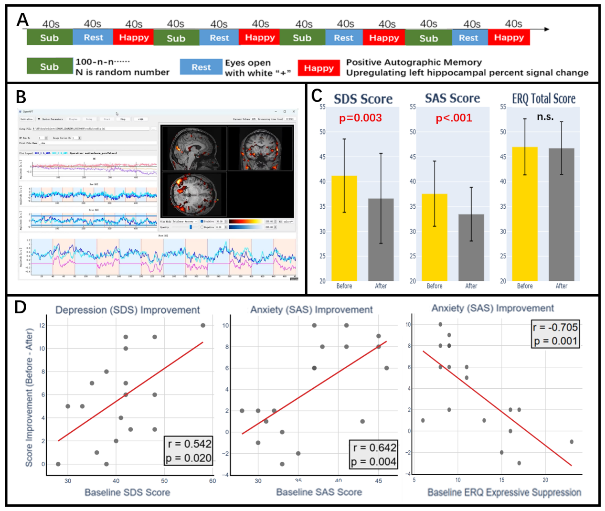
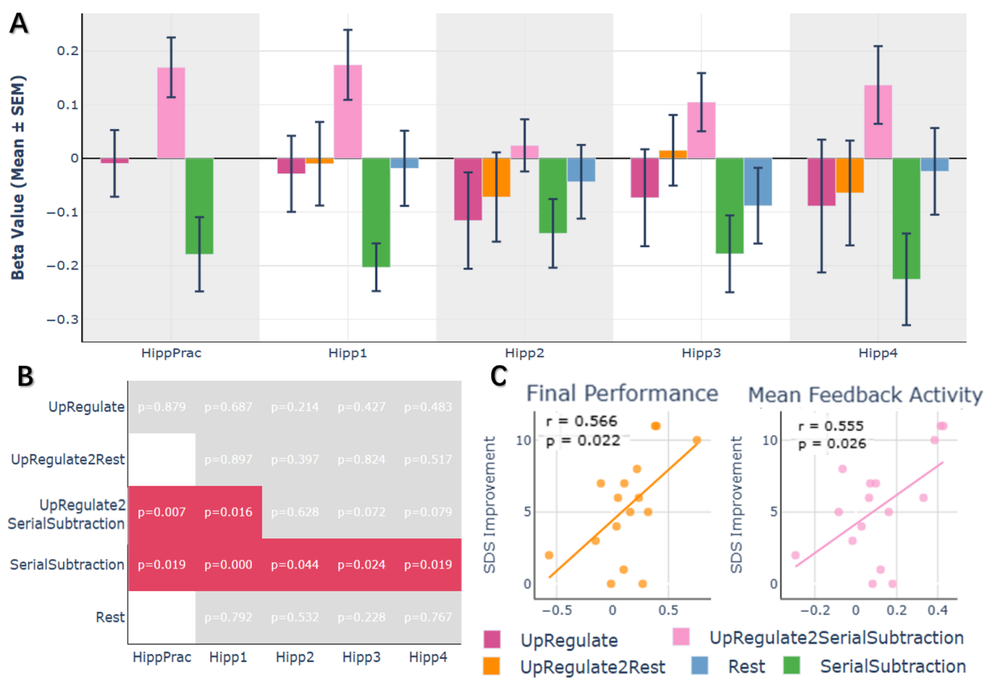
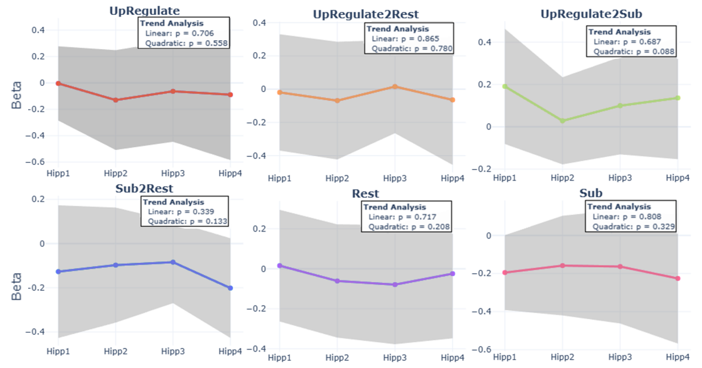
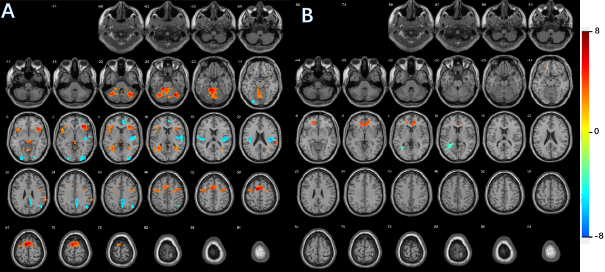

> Full archive. For daily AI use `manuscript_digest.md` (slim). Rerun this script after Word edits.

**Title Page**

**Full Title**

Mood improvement by Training Hippocampal Self-Regulation with Real-time fMRI Neurofeedback in healthy young adults

**Author Names**

Lianqing Zhang,Ph.D. a,b\#; Xinyue Hu,M.D. a,b#; Liqiong Liu a,b; Shuangwei Chai a,b; Hailong Li, Ph.D. a,b; Yingxue Gao, Ph.D. a,b; Weijie Bao, M.D., Ph.D. a,b; Ruihan Zhong M.D. a,b, Shuxia Yaod, Minghao Dong, Ph.De., Xiaoqi Huang, M.D., Ph.D . a,b,c\*

\# Lianqing Zhang and Xinyue Hu Contribute equally to this work.

**\*Corresponding author：**

Dr. Xiaoqi Huang, Xiamen Key Lab of Psychoradiology and Neuromodulation, Department of Radiology, West China Xiamen Hospital of Sichuan University, Xiamen, China. julianahuang@163.com. Email: julianahuang@163.com, Tel: 86-28-85423255, Fax: 86-28-85423503.

**Author Affiliation **

a Department of Radiology, Huaxi MR Research Center (HMRRC), Institute of Radiology and Medical Imaging, West China Hospital of Sichuan University, Chengdu, Sichuan, China.

b Psychoradiology Key Laboratory of Sichuan Province, West China Hospital of Sichuan University. Chengdu, Sichuan, China.

c Xiamen Key Lab of Psychoradiology and Neuromodulation, Department of Radiology, West China Xiamen Hospital of Sichuan University, Xiamen

d. The Clinical Hospital of Chengdu Brain Science Institute, MOE-K Lab for NeuroInformation, Brain-Apparatus Communication Institute, University of Electronic Science and Technology of China, Chengdu, 611731, China.

E School of Life Science and Technology, Xidian University, Xi‘an, Shaanxi, 710126, China

**Acknowledgements**

This study was supported by the National Natural Science Foundation of China (grant number 82372080, 82502502), the National Key R&D Program of China (grant number 2022YFF1202400), the Natural Science Foundation of Sichuan Province (grant numbers 2024NSFSC1784 and 2026NSFSC0467) and the Postdoctor Research Fund of West China Hospital, Sichuan University (Grant No. 2024HXBH061).

**Abstract**

**Background**  The hippocampus is a key neural target for mood and memory interventions, but hard to reach with popular non-invasive neuromodulation due to its deep location. As a form of endogenous neuromodulation, real-time fMRI neurofeedback (rt-fMRI-NF) offers a unique approach for the self-regulation of hippocampal function. In the current study we designed a protocol to explore the feasibility, behavioral effects, methodological considerations, and individual trait moderators of rt-fMRI-NF-based hippocampal self-regulation in healthy young adults.

**Methods**: Nineteen healthy young adults underwent a single session, four run training of rt-fMRI-NF. Each run employed a block design consisting of alternating 'Up-Regulation' (40s), 'Serial Subtraction' (40s), and 'Rest' (40s) conditions. During the 'Up-Regulation' condition, participants were instructed to up-regulate their left hippocampus percentage signal change by recalling positive autobiographical memories (AM). Pre- and post-training Self-Rating Depression and Anxiety Scales (SDS/SAS), and emotion regulation questionnaire (ERQ) were assessed and compared. Offline fMRI analyses investigated neural changes and practice-related adaptation.

**Results:** The single-session training was associated with significant reductions in both depression (mean=4.58, p=0.003) and anxiety (mean=4.11, p\<0.001) scores. Greater improvements were predicted by higher baseline distress (ΔSDS, r = 0.54, p = 0.020; ΔSAS, r = 0.64, p = 0.004) and lower expressive suppression (ΔSAS; r = -0.705, p = 0.001). The participants did not show significant target hippocampal activation during 'Up-Regulation' blocks compared to the rest blocks (all p \> 0.21). However, exploratory analyses showed that hippocampal engagement measured against cognitive demanding baseline (Serial Subtraction) was significantly correlated with depression improvement. Whole-brain analyses revealed engagement of a cognitive control network and deactivation of the default mode network.

**Conclusion:** The brief hippocampal neurofeedback training induced mood improvements in healthy young adults particularly for those with higher baseline distress. These mood benefits were associated with to hippocampal engagement measured against an active cognitive baseline. These findings together highlight the therapeutic potential of our protocol and underscores the importance to test it in real depressed or anxiety patients with mood regulation requirement.

Key words: real-time fMRI Neurofeedback, Hippocampus, Endogenous Neuromodulation, Autobiographical Memory, Mood

**\
**

1.  **Introduction**

The hippocampus plays a central role not only in memory processes but also in emotion regulation(1, 2). Given its unique cellular architecture, including its lifelong capacity for neurogenesis, the hippocampus is highly plastic but also particularly vulnerable to the toxic effects of stress(3). For this integral involvement in both memory and mood, hippocampal dysfunction is implicated in the pathophysiology of a range of neuropsychiatric disorders, including Alzheimer's disease, cognitive aging, post-traumatic stress disorder, and Major Depressive Disorder (MDD)(4-6).

 In MDD, this pattern of hippocampal dysfunction is well-documented(2). Structurally, a significant smaller hippocampal volume is one of the most consistent neuroimaging finding of MDD, as confirmed by large-scale, multi-center ENIGMA studies(7, 8). This structural deficit is thought to reflect underlying impairments in neuroplasticity, which could functionally compromise the hippocampus's critical role in the recollection of specific, contextually rich episodic events(2). This impairment in hippocampal-related memory function may in turn contribute to the profound difficulties in autobiographical memory, where patients with MDD show a tendency to retrieve memories in an over-general, non-specific manner(9). Consistent with this hypothesis, neuroimaging studies repeatedly show that individuals with MDD exhibit reduced hippocampal activation during positive AM recall (10, 11). Crucially, this dysfunction is not static; evidence from both preclinical and clinical research indicates that the hippocampus retains a significant capacity for therapeutic change, with successful antidepressant treatments shown to promote neural plasticity and normalize hippocampal structure and function(2, 5).

The evidence of hippocampal dysfunction in mood disorder provides a clear rationale for developing targeted interventions(2). However, given its deep location, it can hardly be reached by popular non-invasive exogenous neuromodulation techniques such as transcranial magnetic stimulation. Real-time fMRI neurofeedback (rt-fMRI-NF) offers a promising, non-invasive endogenous neuromodulation technique to target the hippocampus(12, 13). The technique's core principle is to provide individuals with real-time information about activity in a targeted brain region, thereby enabling them to learn voluntary control over that region's function. This approach has led to significant advances, with a rapidly growing body of literature demonstrating that both healthy and clinical populations can learn to regulate a wide variety of neural targets, including deep subcortical structures like the amygdala and nucleus accumbens(14). This has been translated into promising preliminary therapeutic effects across a range of disorders, with strong support to date seen in reducing symptoms of depression and anxiety(15). The field remains in a dynamic phase of methodological development, with active investigation into optimizing protocol designs and the emergence of advanced approaches such as connectivity-based and decoded neurofeedback to target distributed neural patterns(16). 

Despite these broad advances, the hippocampus itself has remained a relatively underexplored target for this type of self-regulation training. To our knowledge, only one key proof-of-concept study has shown that healthy individuals can learn to up-regulate hippocampal activity using positive AMs(17). While that study successfully established the feasibility of volitional control over the hippocampus, the modulation was not accompanied by significant changes in mood scores. This leaves open the crucial subsequent question: can this demonstrated ability to regulate the hippocampus be leveraged to produce reliable behavioral effects? It is possible that protocol parameters optimized for demonstrating initial neural control may differ from those required to induce a more robust behavioral change.

To take this next step, the present study was designed as a preliminary investigation specifically examining the link between hippocampal self-regulation and mood changes. To maximize the potential for observing a learning effect and to minimize confounding factors in this initial proof-of-concept study, we recruited a homogenous sample of healthy young adults, a population characterized by high neural plasticity(18). Additionally, to provide a distinct cognitive contrast and to minimize potential cognitive residue between regulation blocks, a serial subtraction task was included in the protocol(19, 20). Our primary aim was to test whether a brief, single-session neurofeedback protocol focused on hippocampal up-regulation could induce mood improvements. Second, we sought to conduct an exploratory analysis of how baseline individual traits, such as initial distress and emotion regulation strategies, might moderate the behavioral outcomes of the intervention. Finally, we aimed to elucidate the underlying neural mechanisms associated with the training and to test for evidence of neural adaptation as a function of practice.

**\**

**2. Materials and Methods**

**2.1 Participants**

The study was approved by the Research Ethics Committee of Sichuan University, and all participants provided written informed consent prior to their inclusion. Twenty healthy university students were initially recruited for this study. One participant withdrew during the scan due to an inability to remain still, leaving a final sample of 19 participants for behavioral analyses (13 females, 6 males; mean age = 21.47 ± 1.12 years). Of these, three additional participants were excluded from neuroimaging analyses due to data transmission issues during the real-time fMRI training. Thus, 16 participants had complete and usable fMRI data that were carried forward for all neuroimaging analyses.

All participants were right-handed and were screened for a current or lifetime history of Axis I mental disorders using the Structured Clinical Interview for the DSM-IV. Neurological and other significant medical disorders were excluded based on personal histories and physical examinations. Furthermore, T1-weighted structural scans were reviewed by two experienced neuroradiologists to exclude neuroanatomic abnormalities.

**2.2 Experimental Procedure**

The rt-fMRI-NF training protocol was conducted over two consecutive days. On Day 1, participants were familiarized with the experimental procedure. They were instructed to recall several positive autobiographical memories (AMs) and to write down corresponding keywords to serve as prompts during the training. Inside the scanner, they completed one practice neurofeedback run to acclimate to the task. The formal training took place on Day 2, consisting of four training runs. Each run employed a block design, alternating between 'Up-Regulation' (40s), 'Serial Subtraction' (40s), and 'Rest' (40s) conditions (Fig 1A). During the Up-Regulation blocks, participants recalled their positive AMs to actively increase a feedback signal, which represented the percent signal change (PSC) in their left hippocampus relative to the preceding Rest block (Fig 1B). The Serial Subtraction task required participants to perform continuous mental subtraction (e.g., 100 - 7, 93 - 7, etc.), served a high-level cognitive baseline and to clear cognitive residue from the emotion-laden Up-Regulation blocks. During Rest blocks, participants simply fixated on a crosshair. The third run was designated as a 'Transfer Run', where feedback was withheld to test the internalization of the learned self-regulation strategy. Immediately following the final neurofeedback training run, participants completed the SDS, SAS, and emotion regulation questionnaire (ERQ) for a second time to assess changes in mood and emotion regulation strategies.

**2.3 MRI Data Acquisition**

All MRI data were acquired on a 3T United Imaging Healthcare (UIH) uMR 790 scanner. A high-resolution T1-weighted structural image was acquired for each participant using a 3D fast spoiled gradient-recalled echo sequence with the following parameters: Repetition Time (TR) = 8.5 ms; Echo Time (TE) = 3.1 ms; Inversion Time (TI) = 1080 ms; Flip Angle = 8°; voxel size = 0.8 x 0.8 x 0.8 mm³. Functional data for the neurofeedback runs were acquired using a T2\*-weighted echo-planar imaging (EPI) sequence sensitive to blood-oxygen-level-dependent (BOLD) contrast. The acquisition parameters were: TR = 1000 ms; TE = 30 ms; Flip Angle = 60°; 65 axial slices; Multiband Acceleration Factor = 5; voxel size = 2.5 x 2.5 x 2.5 mm³; acquisition matrix = 84 x 84; phase encoding direction = Anterior to Posterior. Foam padding and earplugs were used to reduce head motion and scanner noise.

**2.4 Real-time fMRI Neurofeedback Setup**

The rt-fMRI-NF system was implemented using the OpenNFT toolbox(21). In real-time, each functional volume was exported from the scanner and preprocessed. This included motion correction by aligning each volume to a reference EPI image acquired at the beginning of each run, and online linear detrending to remove signal drift.

For each participant, the target region of interest (ROI) was the left hippocampus, anatomically defined using the Automated Anatomical Labeling (AAL) atlas in MNI space. To map this atlas-based ROI into the participant’s native functional space, we first co-registered the individual's T1-weighted structural image and functional image to MNI template to get transform matrix and inverse matrix. Then, we applied the inverse matrix to AAL defined left hippocampus to acquire left hippocampus mask in individual native space. The average BOLD signal was then extracted from this individualized ROI mask at each TR and the neurofeedback signal was computed as the percent signal change (PSC) relative to the average signal in the preceding 'Rest' block. This feedback was presented to the participant visually on a screen inside the scanner bore. The interface consisted of a stationary white dot at the center of a black screen, which served as a zero-baseline. The real-time PSC was displayed as a horizontal green line whose vertical position was updated every TR (1s). A stationary red line was positioned in the upper portion of the screen, providing a target for participants to reach or surpass during the up-regulation blocks.

**2.5 Behavioral Data Analysis**

All statistical analyses of the behavioral data were performed using Python. To assess the effectiveness of the neurofeedback training, changes in depression and anxiety scores (SDS and SAS) from pre- to post-training were evaluated using paired-samples t-tests. Effect sizes were calculated using Cohen's d. To investigate the relationship between baseline characteristics and training-induced improvements, we conducted Pearson correlation analyses. Specifically, we correlated the change scores (pre-training minus post-training) for SDS and SAS with baseline SDS/SAS scores and with total and subscale scores from the ERQ. Following visual inspection, data points with standardized residuals exceeding ±2.5 were formally excluded to ensure the robustness of the correlation. A significance level of p \< 0.05 was used for all behavioral analyses.

**2.6 Offline fMRI Data Preprocessing and Analysis**

**fMRI Data Preprocessing.** Offline preprocessing of all fMRI data was performed using fMRIPrep 20.2.0, which is based on Nipype 1.5.1(22, 23). The T1-weighted (T1w) anatomical image was corrected for intensity non-uniformity, skull-stripped, and segmented into cerebrospinal fluid (CSF), white matter (WM), and gray matter (GM). For each BOLD run, the preprocessing pipeline was as follows. A reference BOLD volume was generated, and susceptibility distortion correction (SDC) was performed using a fieldmap estimated from a dual-echo gradient-recalled echo (GRE) sequence. This fieldmap was co-registered to the BOLD reference and used to calculate a corrected EPI reference, improving subsequent alignment. The BOLD reference was then co-registered to the T1w reference using boundary-based registration (BBR) implemented in FreeSurfer's bbregister. Head-motion parameters (six rotations and translations) were estimated relative to the BOLD reference using FSL's mcflirt. The BOLD time-series were then slice-time corrected using AFNI's 3dTshift. A key feature of the fMRIPrep pipeline is that all spatial transformations—including head-motion correction, susceptibility distortion correction, and co-registration—were combined into a single composite transform. This transform was applied in one step to the slice-time corrected BOLD data to generate a final, preprocessed time-series in the participant's original native space, minimizing spatial blurring from multiple interpolations. For group-level analyses, the BOLD time-series were also resampled into the MNI152 standard space. These minimally preprocessed BOLD runs were then spatial smoothing with an 8 mm full-width at half-maximum (FWHM) Gaussian kernel in SPM12 (Wellcome Department of Imaging Neuroscience, London, UK) for subsequent statistical analysis.

**First-Level Analysis.** For each participant, a first-level statistical analysis was performed in SPM12 using the general linear model (GLM). The model included separate regressors for the 'Up-Regulation', 'Serial Subtraction', and 'Rest' conditions, each convolved with the canonical hemodynamic response function (HRF). The six head motion parameters derived from fMRIPrep were included as regressors of no interest. First-level contrast images were generated for each condition, as well as for the key comparisons of interest: \[Up-Regulation \> Serial Subtraction\] and \[Up-Regulation \> Rest\]. An additional contrast of \[Serial Subtraction \> Rest\] was also computed for exploratory purposes.

**ROI Analysis:** To test the primary hypothesis of hippocampal modulation, the mean beta values for each condition and contrast were extracted from the AAL-defined left hippocampus ROI for each run of each participant. To assess overall activation, one-sample t-tests were conducted on the beta values from each run against zero. To examine learning dynamics, a one-way repeated-measures ANOVA was conducted with training run (Run 1-4) as the within-subject factor. Within this framework, we specifically employed polynomial contrast analysis to test for significant linear and quadratic (U-shaped) trends across the four runs.

For exploratory purposes, we defined several 'neural modulation efficiency' metrics and correlated them against the change scores for depression (ΔSDS) and anxiety (ΔSAS) to investigate the relationship between neural activity in the target ROI and behavioral improvement. The 'neural modulation efficiency' metrics definition includes: average beta value across the four training runs, final run performance (the beta value of run 4), learning potential (the linear slope of changes across runs), the non-linear pattern (the individual quadratic trend coefficient), mean feedback-period activity (the average of Runs 1, 2, and 4, excluding the transfer run), and modulation variability (the standard deviation of beta values across runs). Beta values for these analyses were derived from the \[Up-Regulation \> Serial Subtraction\] contrast, as our initial ROI-level analyses indicated that this contrast yielded the most robust differential effect within the hippocampus.

**Whole-Brain Analysis:** To identify the network engaged by the task, contrast images for all comparisons of interest were generated for each of the four runs at the first level for each participant, and \[Up-Regulation \> Rest\] contrast maps were then entered into group-level one-sample t-test to determine the average task effect across the entire sample. We implemented a whole-brain, one-way repeated-measures ANOVA with training run (Run 1-4) as the within-subject factor. Overall F-contrast, and exploratory linear trends over the course of training were examined. All whole-brain statistical maps were corrected using a voxel-level threshold of p \< 0.001 (uncorrected), with a cluster-level significance of p \< 0.05, Family-Wise Error (FWE) corrected for multiple comparisons.

**Generalized Psycho-Physiological Interaction (gPPI) Analysis:** To investigate potential changes in functional connectivity driven by the task, a gPPI analysis was conducted using the xxxx toolbox. The left hippocampus served as the seed region. This analysis aimed to identify brain regions whose functional coupling with the left hippocampus differed significantly during the 'Up-Regulation' condition compared to the 'Serial Subtraction' condition.

**3. Results**

**3.1 Behavioral Outcomes**

The study sample consisted of healthy university students (N=19; 13 female; mean age = 21.47 ± 1.12 years). Following the rt-fMRI-NF training, participants' mean depression scores (SDS) significantly decreased by an average of 4.58 (p = 0.003; Cohen's d = 0.79), and mean anxiety scores (SAS) decreased by 4.11 (p \< 0.001; Cohen's d = 0.98, Fig 1C and Table 1). Among the 19 included participants, only one had a baseline SDS score (58) above the clinical cutoff of ≥ 53. After the four neurofeedback runs, this participant's SDS score was reduced to 46, within the normal range. The neurofeedback protocol did not induce any significant changes in participants' scores on the ERQ (total or subscales, all p \> 0.24).

Correlation analyses revealed a strong positive correlation between baseline SDS scores and the magnitude of depression improvement (ΔSDS, r = 0.542, p = 0.020, Figure 1D) after the removal of one statistical outlier. A similar, even stronger, relationship was found for anxiety, where higher baseline SAS scores were significantly correlated with greater anxiety reduction (ΔSAS, r = 0.642, p = 0.004, Figure 1C). We also found a significant negative correlation between baseline scores on the 'Expressive Suppression' subscale of the ERQ and the magnitude of anxiety reduction (ΔSAS; r = -0.705, p = 0.001, Figure 1D). See Supplementary Figure 1 for data with outlier included.

**3.2 Analysis of the Target Hippocampal ROI**

To test our primary hypothesis, we first examined activity within the pre-defined target ROI, the left hippocampus. Our analysis of the task conditions, visually summarized in Fig 2, revealed no significant activation during 'Up-Regulation' blocks against the rest blocks (mean betas ranged from -0.029 to -0.116; all p \> 0.21). In contrast, the 'Serial Subtraction' task consistently induced significant deactivation in the left hippocampus across all runs (mean betas ranged from -0.140 to -0.226; all p \< 0.05). Consequently, the \[Up-Regulation \> Serial Subtraction\] contrast was significantly positive during the initial practice run (mean beta = 0.169, p = 0.007) and the first formal training run (mean beta = 0.174, p = 0.016, Fig 2B). This effect appears to be driven by the strong deactivation during the Serial Subtraction task rather than by successful upregulation during the positive AM recall task. The \[Up-Regulation \> Rest\] contrast was not significant in any run. All detailed statistical results for the ROI analysis are provided in Supplementary Table 1.

Subsequent repeated-measures ANOVA with polynomial contrasts revealed no significant linear trend for the key contrasts (all p \> 0.68). A marginally significant quadratic (U-shaped) trend was observed for the \[Up-Regulation \> Serial Subtraction\] contrast (p = 0.088, Fig 4), suggesting a potential non-linear dynamic over the course of the training (Fig 3).

To explore a potential link between hippocampal modulation and mood improvement, we performed a series of correlation analyses using several exploratory definitions of 'neural modulation efficiency'. A consistent pattern emerged for the improvement in depression scores (ΔSDS). Several distinct metrics of neural efficiency ('average beta', 'final performance', 'mean feedback activity', and the 'non-linear pattern') showed moderately strong positive correlations with ΔSDS, with r values approaching or exceeding 0.5 (Supplementary Table 2 and Supplementary Figure 2). Of these, associations between SDS improvements and 'final performance' (r = 0.57, p = 0.022) and 'mean feedback activity' (r = 0.56, p = 0.026) reached nominal statistical significance (Figure 2C). Given the exploratory nature of these analyses, these uncorrected p-values should be interpreted with caution.

Finally, to complete our investigation of the target ROI, a gPPI analysis seeded from the left hippocampus also revealed no significant task-dependent changes in functional connectivity.

**3.3 Whole-Brain Activation Patterns**

Average brain activity for the \[Up-Regulation \> Rest\] contrast showed significant activations in the bilateral cerebellum, supplementary motor area (SMA), insula, and precentral gyrus (Table 2, Figure 4A). Significant deactivations were observed in nodes of the default mode network (DMN), including the bilateral middle/inferior occipital lobe, posterior cingulate/precuneus and angular gyrus, as well as in bilateral auditory cortices (Heschl's gyrus).

Beyond this average activation, we explored how brain activity adapts with practice. These exploratory analyses revealed significant positive linear trends in a cluster centered on the anterior cingulate and medial prefrontal cortex, while significant negative linear trends were found in the posterior cingulate/precuneus (Figure 4B, Supplementary Table 3).

Finally, the overall F-contrast from the repeated-measures ANOVA identified the bilateral Temporo-occipital Cortex (MTG/IOG) and the right supramarginal gyrus whose activity was significantly modulated across runs. Post-hoc analyses of these regions revealed a consistent pattern: they were activated during the neurofeedback runs (Runs 1, 2, and 4) but significantly deactivated during the transfer run (Run 3), with full statistical details provided in Supplementary Table 4 and Supplementary Figure 3.**\**

**4. Discussion**

The present study explored the effects of a simple rt-fMRI-NF protocol designed to train healthy individuals to up-regulate their left hippocampus. We observed that this single-session intervention was associated with a significant reduction in self-reported depression and anxiety scores, with the magnitude of this improvement being moderated by baseline distress and emotion regulation strategy. However, the mechanism underlying this behavioral benefit appears more complex than simple target up-regulation. We found no evidence of learned control over the intended \[Up-Regulation \> Rest\] feedback signal in the target hippocampus. Nonetheless, exploratory analyses revealed that the mood improvements were, in fact, significantly associated with hippocampal engagement when it was measured against a more sensitive, cognitively demanding baseline. This suggests that successful engagement of the target region is critical, even when modulation of the conventional feedback signal is not achieved. This process of self-regulation was accompanied by the engagement and systematic adaptation of a broader cognitive control network, including key nodes in the anterior cingulate and posterior default mode network. Taken together, these findings highlight the potential therapeutic benefits of this hippocampal targeted endogenous neuromodulation protocol while underscoring the critical importance of methodological considerations—particularly the choice of an appropriate baseline—when attempting to regulate hippocampal activation.

**4.1 The Behavioral Efficacy and Its Predictors**

A primary finding of this study is that the brief, single-session neurofeedback protocol was associated with a significant reduction in self-reported depression and anxiety scores. While previous studies have reported that autobiographical memory recall within a real-time neurofeedback framework can exert a beneficial effect on mood, these effects often accompany successful activation of the targeted ROI (e.g., Young et al., 2017(24) using amygdala as ROI). Our study further suggests that this intervention paradigm can induce a positive emotional outcome even in the absence of robust, learned enhancement of the target ROI.

Furthermore, our results revealed important individual traits that predicted the extent of this improvement. First, we found that individuals with higher baseline distress benefited most from the training. This aligns with research in other psychological interventions, which consistently reports that individuals with higher baseline distress show greater benefits from interventions like mindfulness(25) and cognitive training(26). However, this relationship can be complex; Burić et al. noted that while higher baseline psychopathology was associated with deterioration in some cases, participants with higher motivation and mindfulness showed better outcomes, suggesting that individual characteristics significantly moderate intervention effectiveness(27). Therefore, whether the benefits observed here can be extended to clinically depressed patients, and identifying which populations would benefit most from this intervention, remain important questions for future study.

Second, we observed that a higher trait of Expressive Suppression (ES) was a significant predictor of poorer behavior outcomes in anxiety reduction; that is, higher ES scores were associated with smaller reductions in anxiety, and some individuals with the highest ES scores even showed an increase in anxiety post-training. ES is a response-focused strategy defined as the conscious attempt to hide, inhibit, or reduce ongoing emotional-expressive behavior(28). Literature suggests suppression is effective for reducing the expression of negative emotions to others but not for regulating the internal experience of negative emotions  (29, 30). A previous study further reported that the positive effect of cognitive reappraisal on autobiographical memory was only present for participants who were low on suppression, suggesting that the habitual use of ES may hinder the recall of positive memories (31). Our study provides further support for this notion, suggesting that individuals with a high trait of ES may not benefit from rt-fMRI-guided recall of positive memories with minimal instruction. For these individuals, the intervention may need to be augmented with other, more targeted imagery strategy instructions. Taken together, these findings highlight that the benefits of this neurofeedback paradigm are not uniform, but are instead significantly moderated by key pre-existing psychological characteristics of the individual.

**4.2 Reinterpreting the Role of the Hippocampal Target**

An important finding of our study is the observed dissociation between the positive behavioral outcomes and the activity of the intended neural target *as defined by the feedback signal*. Despite the significant reduction in self-reported depression and anxiety, we did not observe evidence of successful, learned up-regulation of the left hippocampus when using the \[Up-Regulation \> Rest\] contrast. However, our ROI-level analyses revealed that the cognitively demanding 'Serial Subtraction' task induced a significant and reliable deactivation of the hippocampus. This created a much lower, more stable baseline, making the differential activity during the \[Up-Regulation \> Serial Subtraction\] contrast a more sensitive and interpretable measure of task-specific hippocampal engagement. This interpretation is further supported by our exploratory brain-behavior analyses. Specifically, when 'neural modulation efficiency' was defined using beta values of \[Up-Regulation \> Serial Subtraction\] contrast, metrics such as final run performance and average feedback-period activity were strongly correlate with greater depression improvement.

This key finding highlights two important considerations for the design and interpretation of neurofeedback studies targeting the hippocampus. First, the choice of baseline is particularly critical. The hippocampus, a core node of the default mode network (DMN), is consistently engaged during wakeful rest and is intrinsically tied to internally directed cognitive processes, such as autobiographical memory recall(32-34). This effect may particularly profound in the hippocampus. A study reported that activity in the medial temporal lobe (including the hippocampal region) was substantially higher during rest than during externally-focused tasks (e.g. the odd/even task, the arrow task, and the visual-noise task), demonstrating that 'rest' is a period of significant cognitive activity, not a neutral physiological zero in the hippocampus(19). Consequently, using 'rest' as a baseline to our feedback signal creates a scenario where the high-level activity during AM recall is contrasted against an already-active and variable baseline, potentially masking the true task-related signal and leading to an underestimation of the effect. Our exploratory analyses further provided an important empirical guideline for future study design. While 'rest' is remains a conventional baseline in many neurofeedback protocols, our findings suggest it may be particularly ill-suited for training the hippocampus. Our data provide direct evidence that an 'active baseline'—using a cognitively demanding task like serial subtraction to induce a stable, low-activity state in the hippocampus—offers a more valid and sensitive contrast for detecting and training genuine increases in memory-related activity.

Second, while the feedback signal itself may have been suboptimal, the underlying neural process of hippocampal engagement (when measured with an appropriate contrast) was strongly associated with the therapeutic outcome. A key cognitive feature of depression is a bias towards recalling negative over positive memories, as well as a tendency to recall memories in an over general, non-specific manner(35, 36). The hippocampus is central to the retrieval of autobiographical memories, and Young et al. has directly linked this cognitive impairment to hippocampal hypoactivation in individuals with depression(11). Furthermore, activity within the hippocampus has been positively correlated with memory vividness (37). Therefore, greater hippocampal engagement during the AM task in our study could indicate that more detailed and vivid positive memories were recalled during the training, which in turn may have induced the observed improvement in depression scores. By repeatedly "exercising" the involvement of the hippocampus in positive AM recall, participants may be strengthening these pathways, increasing the vividness of positive memories and thereby fostering a more balanced emotional state. While our study is the first to suggest that successful engagement of the hippocampus during AM neurofeedback training is linked to behavioral improvement in a healthy sample, it remains a critical question for future research whether this neurocognitive mechanism can be effectively targeted to produce therapeutic benefits for individuals with subclinical or clinical depression.

**4.3 Network-Level Effects of the Neurofeedback Training**

Our whole-brain analyses identified significant activation in regions associated with cognitive control and goal-directed action, including the bilateral cerebellum, SMA, insula, and precentral gyrus. Concurrently, we found significant deactivation in task-irrelevant networks, including core nodes of the default mode network (DMN), such as the posterior cingulate/precuneus, and the primary auditory cortex (Heschl's gyrus). The engagement of the SMA and cerebellum is consistent with the reframing of memory recall into a goal-directed "mental action" requiring motor imagery(38, 39), while the insula's involvement points to the role of interoceptive awareness in monitoring the internal states generated by this process(40, 41). The simultaneous suppression of the DMN and auditory cortex likely serves to filter out internal mental chatter(42) and external scanner noise(43), respectively. This overall pattern of engagement is remarkably consistent with the general, target-independent "regulation network" identified in a large-scale meta-analysis by Emmert et al(42). Furthermore, our study extends this finding by showing evidence of neural adaptation within key control nodes. We observed a linear increase in ACC activity across the training runs, suggesting progressively stronger recruitment of top-down cognitive control, alongside a linear decrease in posterior DMN activity, indicating more efficient suppression of task-irrelevant thought. 

Furthermore, our analysis of the transfer run found the temporo-occipital cortex and the right supramarginal gyrus showed a specific 'on-off' response to the presence of feedback.

 The activation in the temporo-occipital cortex likely reflects the "processing of the visual feedback" itself, and potentially the visual imagery associated with tracking the moving line(44, 45). Similarly, the engagement of the temporo-parietal region, including the supramarginal gyrus, is thought to be related to the "integration of the visual feedback" and self-processing in relation to this external signal(45, 46).

Several limitations should be considered. First, the present study was designed as a preliminary investigation to establish feasibility and explore the neural mechanisms of this novel protocol; as such, it did not include a control group, such as a sham-feedback or active-control condition. Therefore, we cannot definitively attribute the observed mood improvements to the neurofeedback process itself, as effects of placebo, repeated positive memory recall, or habituation to the scanner environment cannot be ruled out. Second, it is important to acknowledge that factors such as the short, single-session training duration and the specific \[Up-Regulation \> Rest\] contrast used for feedback may have contributed to the lack of a robust target effect in the hippocampus. Finally, our findings are based on a modest sample of healthy university students, and their generalizability to a clinical population remains to be determined. These limitations, however, are integral to the study's exploratory nature and provide a clear roadmap for future research. A randomized controlled trial employing a credible sham-feedback control group is the essential next step to establish the causal efficacy of this intervention in a clinical or subclinical population. Such a study would benefit from the methodological mechanistic insights gained in the present study.

**5 Conclusion**

In summary, this preliminary study demonstrated that a simple rt-fMRI neurofeedback protocol targeting the hippocampus was associated with significant mood improvements. The study yields three key insights. First, although we did not observe the intended hippocampal activation relative to the rest baseline, the therapeutic effect observed in our study was instead linked to hippocampal engagement when measured against a more sensitive, active cognitive baseline. This highlights the critical limitations of using a 'rest' baseline for DMN-related targets and provides direct evidence for the superiority of an active contrast. Second, we found that these behavioral benefits were moderated by individual characteristics, with greater improvements seen in participants with higher baseline distress and lower levels of expressive suppression. Finally, our whole-brain analyses replicated the general 'regulation network' identified in previous meta-analyses and extended these findings by showing direct evidence of neural adaptation within key control nodes with practice. Together, out study addresses the feasibility of this hippocampal targeted endogenous neuromodulation protocol. These mechanistic and methodological insights from the current study offer important considerations that should inform the design of more robust and effective hippocampal neurofeedback interventions in the future.

**CRediT authorship contribution statement**

**Lianqing Zhang**: Conceptualization, Methodology, Software, Validation, Formal analysis, Investigation, and Writing. Xinyue Hu: Conceptualization, Investigation, Data Curation and Manuscript writing. Liqiong Liu: Data Curation, participants recruiting. Shuangwei Chai: Software configuration, Data Curation. Hailong Li: Software, Formal analysis, Data interpretation. Yingxue Gao: Methodology, Data interpretation. Weijie Bao: Investigation, Visualization. Ping Wang: Methodology, participants recruiting. Ruihan Zhong: Investigation, Data Curation, participants recruiting. Qiyong Gong: Conceptualization, Resources, Supervision, Funding acquisition. Minghao Dong: Conceptualization, Methodology. Xiaoqi Huang: Conceptualization, Methodology, Resources, Writing – Review & Editing, Supervision, Project administration, Funding acquisition.

**Declaration of competing interest**

The authors declare that they have no known competing financial interests or personal relationships that could have appeared to influence the work reported in this paper.

References

1\. Knierim JJ. The hippocampus. Current Biology. 2015;25:R1116-R1121.

2\. Tartt AN, Mariani MB, Hen R, Mann JJ, Boldrini M. Dysregulation of adult hippocampal neuroplasticity in major depression: pathogenesis and therapeutic implications. Molecular psychiatry. 2022;27:2689-2699.

3\. Becker S, Wojtowicz JM. A model of hippocampal neurogenesis in memory and mood disorders. Trends in cognitive sciences. 2007;11:70-76.

4\. Small SA, Schobel SA, Buxton RB, Witter MP, Barnes CA. A pathophysiological framework of hippocampal dysfunction in ageing and disease. Nature reviews Neuroscience. 2011;12:585-601.

5\. MacQueen G, Frodl T. The hippocampus in major depression: evidence for the convergence of the bench and bedside in psychiatric research? Molecular psychiatry. 2011;16:252-264.

6\. Zhang L, Lu L, Bu X, Li H, Tang S, Gao Y, Liang K, Zhang S, Hu X, Wang Y, Li L, Hu X, Lim KO, Gong Q, Huang X. Alterations in hippocampal subfield and amygdala subregion volumes in posttraumatic subjects with and without posttraumatic stress disorder. Human brain mapping. 2021;42:2147-2158.

7\. Ho TC, Gutman B, Pozzi E, Grabe HJ, Hosten N, Wittfeld K, Völzke H, Baune B, Dannlowski U, Förster K, Grotegerd D, Redlich R, Jansen A, Kircher T, Krug A, Meinert S, Nenadic I, Opel N, Dinga R, Veltman DJ, Schnell K, Veer I, Walter H, Gotlib IH, Sacchet MD, Aleman A, Groenewold NA, Stein DJ, Li M, Walter M, Ching CRK, Jahanshad N, Ragothaman A, Isaev D, Zavaliangos-Petropulu A, Thompson PM, Sämann PG, Schmaal L. Subcortical shape alterations in major depressive disorder: Findings from the ENIGMA major depressive disorder working group. Human brain mapping. 2022;43:341-351.

8\. Schmaal L, Veltman DJ, van Erp TG, Samann PG, Frodl T, Jahanshad N, Loehrer E, Tiemeier H. Subcortical brain alterations in major depressive disorder: findings from the ENIGMA Major Depressive Disorder working group. 2016;21:806-812.

9\. Dillon DG, Pizzagalli DA. Mechanisms of memory disruption in depression. Trends in neurosciences. 2018;41:137-149.

10\. Young K, Bellgowan P, Bodurka J, Drevets W. Neurophysiological correlates of autobiographical memory deficits in currently and formerly depressed subjects. Psychological medicine. 2014;44:2951-2963.

11\. Young KD, Erickson K, Nugent AC, Fromm SJ, Mallinger AG, Furey ML, Drevets WC. Functional anatomy of autobiographical memory recall deficits in depression. Psychological medicine. 2012;42:345-357.

12\. Sulzer J, Papageorgiou TD, Goebel R, Hendler T. Neurofeedback: new territories and neurocognitive mechanisms of endogenous neuromodulation. Phil Trans R Soc B. 2024;379.

13\. Watanabe T, Sasaki Y, Shibata K, Kawato M. Advances in fMRI Real-Time Neurofeedback. Trends in cognitive sciences. 2017;21:997-1010.

14\. Linhartová P, Látalová A, Kóša B, Kašpárek T, Schmahl C, Paret C. fMRI neurofeedback in emotion regulation: A literature review. NeuroImage. 2019;193:75-92.

15\. Taschereau-Dumouchel V, Cushing CA, Lau H. Real-time functional MRI in the treatment of mental health disorders. Annual review of clinical psychology. 2022;18:125-154.

16\. Paret C, Goldway N, Zich C, Keynan JN, Hendler T, Linden D, Kadosh KC. Current progress in real-time functional magnetic resonance-based neurofeedback: methodological challenges and achievements. NeuroImage. 2019;202:116107.

17\. Zhu Y, Gao H, Tong L, Li Z, Wang L, Zhang C, Yang Q, Yan B. Emotion Regulation of Hippocampus Using Real-Time fMRI Neurofeedback in Healthy Human. Frontiers in human neuroscience. 2019;13.

18\. Sawyer SM, Azzopardi PS, Wickremarathne D, Patton GC. The age of adolescence. The lancet child & adolescent health. 2018;2:223-228.

19\. Stark CEL, Squire LR. When zero is not zero: The problem of ambiguous baseline conditions in fMRI. Proceedings of the National Academy of Sciences. 2001;98:12760-12766.

20\. Zotev V, Krueger F, Phillips R, Alvarez RP, Simmons WK, Bellgowan P, Drevets WC, Bodurka J. Self-regulation of amygdala activation using real-time fMRI neurofeedback. PloS one. 2011;6:e24522.

21\. Koush Y, Ashburner J, Prilepin E, Sladky R, Zeidman P, Bibikov S, Scharnowski F, Nikonorov A, De Ville DV. OpenNFT: An open-source Python/Matlab framework for real-time fMRI neurofeedback training based on activity, connectivity and multivariate pattern analysis. NeuroImage. 2017;156:489-503.

22\. Esteban O, Markiewicz CJ, Blair RW, Moodie CA, Isik AI, Erramuzpe A, Kent JD, Goncalves M, DuPre E, Snyder M. fMRIPrep: a robust preprocessing pipeline for functional MRI. Nature methods. 2019;16:111-116.

23\. Gorgolewski K, Burns CD, Madison C, Clark D, Halchenko YO, Waskom ML, Ghosh SS. Nipype: a flexible, lightweight and extensible neuroimaging data processing framework in python. Frontiers in neuroinformatics. 2011;5:13.

24\. Young KD, Siegle GJ, Zotev V, Phillips R, Misaki M, Yuan H, Drevets WC, Bodurka J. Randomized clinical trial of real-time fMRI amygdala neurofeedback for major depressive disorder: effects on symptoms and autobiographical memory recall. American Journal of Psychiatry. 2017;174:748-755.

25\. Roemer A, Sutton A, Grimm C, Medvedev ON. Effectiveness of a low‐dose mindfulness‐based intervention for alleviating distress in young unemployed adults. Stress and health. 2021;37:320-328.

26\. Richter T, Shani R, Tal S, Derakshan N, Cohen N, Enock PM, McNally RJ, Mor N, Daches S, Williams AD. Machine learning meta-analysis identifies individual characteristics moderating cognitive intervention efficacy for anxiety and depression symptoms. npj Digital Medicine. 2025;8:65.

27\. Buric I, Farias M, Driessen JM, Brazil IA. Individual differences in meditation interventions: A meta‐analytic study. British journal of health psychology. 2022;27:1043-1076.

28\. Cutuli D. Cognitive reappraisal and expressive suppression strategies role in the emotion regulation: an overview on their modulatory effects and neural correlates. Frontiers in systems neuroscience. 2014;8:175.

29\. Butler EA, Egloff B, Wlhelm FH, Smith NC, Erickson EA, Gross JJ. The social consequences of expressive suppression. Emotion (Washington, DC). 2003;3:48.

30\. Gross JJ, John OP. Individual differences in two emotion regulation processes: implications for affect, relationships, and well-being. Journal of personality and social psychology. 2003;85:348.

31\. Wisco BE, Nolen-Hoeksema S. Valence of autobiographical memories: The role of mood, cognitive reappraisal, and suppression. Behaviour research and therapy. 2010;48:335-340.

32\. Kernbach JM, Yeo BT, Smallwood J, Margulies DS, Thiebaut de Schotten M, Walter H, Sabuncu MR, Holmes AJ, Gramfort A, Varoquaux G. Subspecialization within default mode nodes characterized in 10,000 UK Biobank participants. Proceedings of the National Academy of Sciences. 2018;115:12295-12300.

33\. Spreng RN, Grady CL. Patterns of brain activity supporting autobiographical memory, prospection, and theory of mind, and their relationship to the default mode network. Journal of cognitive neuroscience. 2010;22:1112-1123.

34\. Addis DR, Moscovitch M, McAndrews MP. Consequences of hippocampal damage across the autobiographical memory network in left temporal lobe epilepsy. Brain : a journal of neurology. 2007;130:2327-2342.

35\. Brittlebank A, Scott J, Mark J, Williams G, Ferrier I. Autobiographical memory in depression: state or trait marker? The British Journal of Psychiatry. 1993;162:118-121.

36\. Gotlib IH, Joormann J. Cognition and depression: current status and future directions. Annual review of clinical psychology. 2010;6:285-312.

37\. Gilboa A, Winocur G, Grady CL, Hevenor SJ, Moscovitch M. Remembering our past: functional neuroanatomy of recollection of recent and very remote personal events. Cerebral Cortex. 2004;14:1214-1225.

38\. Hanakawa T, Immisch I, Toma K, Dimyan MA, Van Gelderen P, Hallett M. Functional properties of brain areas associated with motor execution and imagery. Journal of neurophysiology. 2003;89:989-1002.

39\. Lotze M, Halsband U. Motor imagery. Journal of Physiology-paris. 2006;99:386-395.

40\. Craig AD. How do you feel? Interoception: the sense of the physiological condition of the body. Nature reviews neuroscience. 2002;3:655-666.

41\. Critchley HD, Wiens S, Rotshtein P, Öhman A, Dolan RJ. Neural systems supporting interoceptive awareness. Nature neuroscience. 2004;7:189-195.

42\. Emmert K, Kopel R, Sulzer J, Brühl AB, Berman BD, Linden DE, Horovitz SG, Breimhorst M, Caria A, Frank S. Meta-analysis of real-time fMRI neurofeedback studies using individual participant data: How is brain regulation mediated? NeuroImage. 2016;124:806-812.

43\. Laurienti PJ, Burdette JH, Wallace MT, Yen Y-F, Field AS, Stein BE. Deactivation of sensory-specific cortex by cross-modal stimuli. Journal of cognitive neuroscience. 2002;14:420-429.

44\. D'Esposito M, Detre JA, Aguirre GK, Stallcup M, Alsop DC, Tippet LJ, Farah MJ. A functional MRI study of mental image generation. Neuropsychologia. 1997;35:725-730.

45\. Zimmer HD. Visual and spatial working memory: from boxes to networks. Neuroscience & Biobehavioral Reviews. 2008;32:1373-1395.

46\. Arzy S, Thut G, Mohr C, Michel CM, Blanke O. Neural basis of embodiment: distinct contributions of temporoparietal junction and extrastriate body area. Journal of Neuroscience. 2006;26:8074-8081.

**Table 1. Descriptive Statistics and Paired T-test Results for Behavioral Measures (N=19).**

<table style="width:100%;">
<colgroup>
<col style="width: 35%" />
<col style="width: 12%" />
<col style="width: 12%" />
<col style="width: 8%" />
<col style="width: 14%" />
<col style="width: 16%" />
</colgroup>
<thead>
<tr>
<th></th>
<th>
Before

(Mean ± SD)
</th>
<th>
After

(Mean ± SD)
</th>
<th>T value</th>
<th>Cohen's d</th>
<th>P value</th>
</tr>
</thead>
<tbody>
<tr>
<td><strong>Self-Rating Depression Scale (SDS)</strong></td>
<td>41.21 ± 7.37</td>
<td>36.63 ± 9.03</td>
<td>3.44</td>
<td>0.79</td>
<td><em>p</em>=0.003**</td>
</tr>
<tr>
<td><strong>Self-Rating Anxiety Scale (SAS)</strong></td>
<td>37.58 ± 6.55</td>
<td>33.47 ± 5.40</td>
<td>4.29</td>
<td>0.98</td>
<td> <em>p</em>&lt;0.001***</td>
</tr>
<tr>
<td><strong>Emotion Regulation Questionnaire (ERQ)</strong></td>
<td></td>
<td></td>
<td></td>
<td></td>
<td></td>
</tr>
<tr>
<td>    Total Score</td>
<td>47.00 ± 5.64</td>
<td>46.74 ± 5.29</td>
<td>0.31</td>
<td>0.07</td>
<td>0.757</td>
</tr>
<tr>
<td>    Cognitive Reappraisal</td>
<td>34.68 ± 4.35</td>
<td>35.16 ± 4.52</td>
<td>-0.58</td>
<td>-0.13</td>
<td>0.566</td>
</tr>
<tr>
<td>    Expressive Suppression</td>
<td>12.32 ± 4.75</td>
<td>11.58 ± 4.59</td>
<td>1.21</td>
<td> 0.28</td>
<td>0.243</td>
</tr>
</tbody>
</table>

Note: \*\*\**p* \< 0.001, \*\**p* \< 0.01

**Table 3. Brain regions showing significant activation and deactivation for the \[Up-Regulation \> Rest\] contrast.**

<table>
<colgroup>
<col style="width: 36%" />
<col style="width: 14%" />
<col style="width: 16%" />
<col style="width: 14%" />
<col style="width: 18%" />
</colgroup>
<thead>
<tr>
<th><strong>Anatomical Region</strong></th>
<th><strong>Hemi</strong></th>
<th><strong>Cluster Size (k)</strong></th>
<th><strong>Peak T-value</strong></th>
<th>
<strong>MNI Coordinates</strong>

<strong>(x, y, z)</strong>
</th>
</tr>
</thead>
<tbody>
<tr>
<td colspan="5"><strong>Activations (Up-Regulation &gt; Rest)</strong></td>
</tr>
<tr>
<td>Cerebellum</td>
<td>B</td>
<td>1742</td>
<td>9.92</td>
<td>31, -63, -26</td>
</tr>
<tr>
<td>Supplementary Motor Area (SMA)</td>
<td>B</td>
<td>976</td>
<td>9.44</td>
<td>-9, 3, 62</td>
</tr>
<tr>
<td>Insula</td>
<td>R</td>
<td>429</td>
<td>8.69</td>
<td>34, 33, 2</td>
</tr>
<tr>
<td>Insula</td>
<td>L</td>
<td>343</td>
<td>5.67</td>
<td>-32, 30, 4</td>
</tr>
<tr>
<td>Precentral Gyrus</td>
<td>R</td>
<td>321</td>
<td>6.45</td>
<td>41, 0, 49</td>
</tr>
<tr>
<td>Precentral Gyrus</td>
<td>L</td>
<td>289</td>
<td>6.16</td>
<td>-37, -3, 54</td>
</tr>
<tr>
<td>Left Middle Temporal Gyrus</td>
<td>L</td>
<td>260</td>
<td>6.00</td>
<td>-32, -55, 9</td>
</tr>
<tr>
<td></td>
<td></td>
<td></td>
<td></td>
<td></td>
</tr>
<tr>
<td colspan="5"><strong>Deactivations (Rest &gt; Up-Regulation)</strong></td>
</tr>
<tr>
<td>Heschl's Gyrus / insula</td>
<td>R</td>
<td>524</td>
<td>7.70</td>
<td>41, -23, 24</td>
</tr>
<tr>
<td>Heschl's Gyrus / insula</td>
<td>L</td>
<td>172</td>
<td>5.81</td>
<td>-42, -20, 22</td>
</tr>
<tr>
<td>Occipital Lobe (Mid/Inf)</td>
<td>R</td>
<td>234</td>
<td>6.49</td>
<td>41, -93, -1</td>
</tr>
<tr>
<td>Occipital Lobe (Inf)</td>
<td>L</td>
<td>142</td>
<td>5.70</td>
<td>-24, -90, -9</td>
</tr>
<tr>
<td>Posterior Cingulate / Precuneus</td>
<td>R</td>
<td>295</td>
<td>6.61</td>
<td>6, -48, 37</td>
</tr>
<tr>
<td>Right Angular Gyrus</td>
<td>R</td>
<td>165</td>
<td>5.25</td>
<td>46, -65, 32</td>
</tr>
</tbody>
</table>

*Note: L=Left, R=Right, B=Bilateral, k=cluster size in voxels, MNI=Montreal Neurological Institute coordinates.* Results are thresholded at p \< 0.001 (uncorrected) at the voxel level, with a cluster-level significance of p \< 0.05, FWE-corrected.

**Figure 1. Hippocampal real-time fMRI neurofeedback protocol and Training-Induced Mood Improvement.**\
(A) Schematic of the block design used in each of the four training runs, consisting of alternating 40-second blocks of Serial Subtraction ('Sub'), Rest, and Positive Autobiographical Memory recall ('Happy'). (B)An illustration of the real-time neurofeedback setup, showing the OpenNFT interface used to define the target region of interest (left hippocampus) and monitor the BOLD signal during the experiment. (C) Bar charts demonstrating significant pre- to post-training reductions in self-reported depression (SDS; p = 0.003) and anxiety (SAS; p \< 0.001) scores. No significant change was observed in the Emotion Regulation Questionnaire (ERQ) total score. Error bars represent standard deviation. (D) Correlations show that baseline mood distress and personal emotion strategy predict mood improvement. Greater improvement in depression (ΔSDS; r = 0.542, p = 0.020, left) and anxiety (ΔSAS; r = 0.642, p = 0.004, middle) was associated with higher baseline scores. Greater anxiety improvement was also significantly associated with lower baseline scores on the 'Expressive Suppression' subscale of the ERQ (r = -0.705, p = 0.001,right).

**Figure 2. Left Hippocampus ROI Activity and Statistical Significance Across Training Runs.**\
(A) Bar chart displaying the mean beta values (± SEM) from the left hippocampus ROI for each task condition and key contrast across the practice run (HippPrac) and four formal training runs. This visually illustrates the lack of positive activation during the 'Up-Regulate' condition and the consistent, strong deactivation during the 'Serial Subtraction' condition.

(B) Significance overview from one-sample t-tests. Red cells indicate a statistically significant effect (p \< 0.05), highlighting the robust deactivation during 'Serial Subtraction' and the significant \[Up-Regulation \> Serial Subtraction\] contrast in the first two runs.

(C) Exploratory correlations linking neural modulation efficiency (derived from the \[Up-Regulation \> Serial Subtraction\] contrast) with depression improvement. Greater depression improvement (ΔSDS) was significantly correlated with both 'Final Performance' (the beta value in the final run; r = 0.566, p = 0.022) and 'Mean Feedback Activity' (the average beta across runs with feedback; r = 0.555, p = 0.026). Each dot represents an individual participant.

**Figure 3. Temporal Dynamics and Learning Trends in the Left Hippocampus ROI.** Mean beta values (± SEM) are plotted across the four formal training runs for each primary condition and key contrast. Inset boxes display the p-values from the polynomial trend analysis used to test for linear and quadratic (U-shaped) patterns. The analysis revealed no significant linear learning trends across the runs for any condition. A marginally significant quadratic trend was observed for the \[Up-Regulation \> Serial Subtraction\] contrast (p = 0.088), suggesting a non-linear dynamic of modulation efficiency over the course of the training.

**Figure 4. Whole-Brain Engagement and Adaptation Patterns for the \[Up-Regulation \> Rest\] Contrast.**\
**(A)** The average brain activity across all four training runs. Activations (hot colors) are prominent in sensorimotor and interoceptive networks, including the cerebellum, supplementary motor area (SMA), and insula. Deactivations (cool colors) are observed in key nodes of the default mode network (posterior cingulate/precuneus) and in bilateral auditory cortices. **(B)** Brain regions exhibiting significant linear trends in activity over the course of the training, indicating neural adaptation. A positive linear trend (increasing activity with practice; hot colors) is evident in the anterior cingulate / medial prefrontal cortex. A negative linear trend (decreasing activity with practice; cool colors) is observed in the posterior cingulate / precuneus. All statistical maps are displayed on a standard MNI template and are thresholded at a voxel-level of p \< 0.001 (uncorrected) with a cluster-level significance of p \< 0.05 (FWE-corrected). The color bar indicates the T-value for the corresponding contrast.
