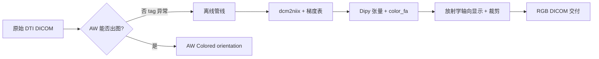

---
tags:
  - 临床知识
  - DTI
  - GE-AW
  - DICOM
date: 2026-05-19
status: 已定稿
sample_project: C:\Users\41516\Desktop\SampleData-GE-DTI
---

# GE DTI：AW 对比剂标签异常与离线 Color FA

> **用途：** 后期遇到「GE AW 不出 FA / Colored orientation」或需离线交付 DEC 图时复用。  
> **代码：** 同目录 `scripts/`（不含 DICOM / NIfTI 数据）。  
> **试点数据：** `C:\Users\41516\Desktop\SampleData-GE-DTI`（jiang 定稿交付；对照验证已完成，不保留对照数据）。

---

## 1. 项目背景

### 1.1 临床/工作站场景

- **设备：** GE SIGNA + **Advantage Workstation (AW)** 后处理。
- **目标图：** 轴向 **Colored orientation**（FA 加权的 RGB 方向编码图，DEC / color FA）。
- **正常流程：** 导入检查后，在 DTI 序列上 **Compute fiber orientation**，AW 自动生成 FA、Trace、Colored orientation 等派生序列。

### 1.2 本例现象

| 病例 | 原始 DTI 序列 | AW 表现 |
|------|---------------|---------|
| jiang（问题） | `DICOM/PA0/ST0/SE6`，`ContrastBolusAgent=15` | 报错 *Maps are not computed by default… pre/post enhancement*；**无** FA / Colored orientation |

jiang 的原始像素与梯度方向可用来做 DTI 拟合，但 AW **拒绝按默认流程出图**，采用 **离线补救（方案 B）** 交付。

（开发期曾用正常对照病例验证管线与梯度提取；验收后已从试点目录移除。）

### 1.3 项目目标与结论

- **目标：** 得到与 AW 轴向 Colored orientation **视觉一致** 的图，并能以 **DICOM** 交付（PACS / 在线浏览器查看）。
- **结论：** **方案 B（离线拟合 → RGB DICOM）** 已验收，作为可复用落地路径。

---

## 2. 技术栈与痛点

### 2.1 技术栈

| 层次 | 工具 | 作用 |
|------|------|------|
| DICOM 读写 | **pydicom** | 读 tag、写 Secondary Capture |
| 转换 | **dcm2niix** | DICOM → NIfTI +（多数情况）bval/bvec |
| 扩散拟合 | **Dipy** `TensorModel`、`color_fa` | 张量拟合 → FA + 主特征向量 → RGB |
| 体数据 | **nibabel** | NIfTI 仿射、层位置 |
| 显示烧录 | **Pillow** | AW 风格黄字 overlay 写入像素 |
| 环境 | Python 3 + Miniconda | 见下文运行命令 |

依赖安装：

```powershell
pip install dcm2niix dipy nibabel pydicom pillow
```

### 2.2 痛点归纳

1. **AW 非开放算法：** Colored orientation 为 AW 黑盒；离线复现显示逻辑并与 AW 目视对齐。
2. **GE 私有 tag：** 对比剂状态 `(0019,1011)`、协议块 `(0025,101B)`、扩散方向 `(0019,10BB/BC/BD)` 等，标准 DICOM 查看器不解析，但 **AW 决策强依赖**。
3. **异常对比剂值：** jiang 多序列 `ContrastBolusAgent=15`（非 `Y`），协议名含 `+C111`，AW 按 **增强/pre-post** 逻辑处理，抑制默认 DTI 图谱计算。
4. **梯度表来源不一：** 有 `(0025,101B)` 时 dcm2niix 可出 bvec；jiang 需从 GE 私有 tag 抽梯度，且 **x 分量需取反** 才与 dcm2niix 一致（已在正常病例上验证）。
5. **显示 ≠ 体素空间：** AW 图是 509 画布 + 裁剪 + 烧录文字；交付采用 **「位图即所见」** 的 SC 策略。

---

## 3. 落地解决方案



### 方案 B：离线 Color FA → DICOM

**主入口：** `scripts/run_offline_colorfa.py`

```powershell
cd <含 DICOM 数据的项目根目录>
python scripts/run_offline_colorfa.py
# 输出: jiang_offline_output/DICOM_ColorFA_generic/
```

修改脚本内 `DTI_DIR`、`OUT_DIR` 以适配新数据。

**交付物：** 仅 **DICOM 序列**（默认不生成 PNG）。查看：RadiAnt、Weasis、在线 DICOM 浏览器。

**中间文件（可删）：** `*_offline_colorFA_rgb.nii.gz`、`*_offline_fa.nii.gz`、`_work/`。

---

## 4. 关键技术点

### 4.1 DICOM tag 如何导致 GE AW 不识别？

AW 报错核心是：工作站把该检查当成 **带对比剂/需要指定 pre-post 增强参数** 的流程，**默认不计算** DTI 派生图（FA、方向图等）。

#### 正常 vs 异常（扫描摘要，来自开发期对照）

| 项目 | 正常 DTI（对照） | jiang SE6（DTI） |
|------|------------------|------------------|
| `(0018,0010) ContrastBolusAgent` | **Y** | **15**（非标准枚举） |
| `ProtocolName` | `-HX-Brain-DTI+c(48CH)` | `-HX-Brain+C111` |
| GE `(0019,1011)` 序列对比剂 | 有 | **缺** |
| GE `(0025,101B)` 协议参数块 | 有 | **缺** |
| 扩散方向 `(0019,10BB/BC/BD)` | 有 | 有（可离线抽梯度） |

全检查：jiang **ST0/ST1 多序列** 均为 `ContrastBolusAgent=15` 或 `15 gd`；AW 可能在 study 层面一致按「增强检查」处理。

**实践建议：** 若 AW 仍报错，直接走 **离线方案 B**。

---

### 4.2 FA 离线计算（简要流程）

管线在 `scripts/dti_core.py` + `run_offline_colorfa.py`：

1. **DICOM → NIfTI：** `dcm2niix`（保留仿射 `affine`）。
2. **梯度表：**
   - 优先使用 dcm2niix 生成的 `.bval` / `.bvec`；
   - 若无：从 GE tag **`(0019,10BB)`、`(0019,10BC)`、`(0019,10BD)`** 读方向，按 `InstanceNumber` 排序；**第 0 列（x）× (−1)** 与 dcm2niix 对齐。
3. **脑掩膜：** `median_otsu`（取中间若干 b=0/低 b 层）。
4. **拟合：** `TensorModel(gtab).fit` → `tenfit.fa`、`tenfit.evecs`。
5. **Color FA：** `color_fa(fa, evecs)`，clip 到 [0,1]，得到 RGB 体数据 `(X,Y,Z,3)`。

---

### 4.3 输出 DICOM 的 tag 策略

最终序列：`DICOM_ColorFA_generic/`，每张 **509×509 RGB**，overlay **烧录在像素内**（`BurnedInAnnotation=YES`）。

#### 写入 / 保留

| 类别 | 策略 |
|------|------|
| 患者与检查 | 从源 DTI 复制 group `0008/0010/0020` 中 **非 UID** 字段 |
| Study UID | 与源检查 **相同** `StudyInstanceUID` |
| Series | **新** `SeriesInstanceUID`；`SeriesNumber=901`；`SeriesDescription=DTI Color FA (DEC map)` |
| 像素 | `SamplesPerPixel=3`，`PhotometricInterpretation=RGB`，8 bit |
| 标识 | `ImageType=DERIVED/SECONDARY/OTHER`，`Manufacturer=OFFLINE_DTI` |

#### 故意不写

- `ImageOrientationPatient`、`ImagePositionPatient`、`SliceLocation`
- `PixelSpacing`、`SliceThickness`、`FrameOfReferenceUID`
- 全部 **GE 私有 tag**

AW 原生 Colored orientation 为 screen-save 风格；本方案用 **RGB 烧录 SC**，在线浏览器可读（本例已验收）。

---

### 4.4 图像方向问题

#### 显示变换（与 AW 轴向屏显对齐）

```text
轴向层 sl = volume[:, :, k, :]
1) rot90(k=1)
2) fliplr         # 放射学约定：屏上左侧 ≈ 患者右侧
```

可选 `--flip-ap` / `--flip-lr`；jiang 默认 **False**。

#### 裁剪与画布

- **中间 3 层** FA≥0.18 算 **同一 bbox**，全层共用。
- 等比缩放到 **509×509**，边距 8%；黄字 overlay 烧录在像素内。

---

## 5. 脚本索引（`scripts/`）

| 文件 | 作用 |
|------|------|
| **`run_offline_colorfa.py`** | 一键：拟合 → NIfTI → DICOM |
| `dti_core.py` | dcm2niix、GE 梯度、张量/color FA |
| `export_colorfa_dicom.py` | 仅导出 DICOM（分步） |
| `aw_style_axial_export.py` | 方向/裁剪/overlay；可选 PNG |

修改 `run_offline_colorfa.py` 内 `DTI_DIR`、`OUT_DIR` 即可复用。


---

## 6. 相关链接

- 试点工程说明（桌面）：`SampleData-GE-DTI/GE-DTI-对比剂标签与离线处理说明.md`

---

## 变更记录

| 日期 | 内容 |
|------|------|
| 2026-05-19 | 从 SampleData-GE-DTI 整理入库；方案 B 定稿 |
| 2026-05-22 | 清理试点目录：移除对照/validation/方案 A；输出 `jiang_offline_output`；脚本改为单病例入口 |
