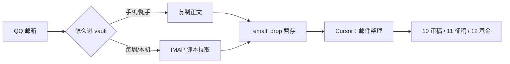

# 第 3 篇 · 素材收集（审稿邮件别再堆三周）

> 成稿前只记素材，不写发布版三项。脱敏见 [[工作流分享-写作与脱敏规范]]。

## 本篇角度（暂定）

- **痛点**：基金/审稿/征稿通知在 QQ 邮箱里，截止日散在正文，容易漏。
- **和 vault 的关系**：`10/11/12` 三类 deadline 任务单独成轨，不和主线科研笔记搅在一起（承接第 1 篇结构）。
- **反差**：坚果云/Obsidian 笔记可以同步，**邮箱授权码每台电脑各配一份**，不进仓库。

## 真实 setup 记录（2026-06-04 · 笔记本新机）

| 项 | 说明 |
|----|------|
| 用户变量 | `QQ_MAIL_USER` = **完整 QQ 邮箱地址**（如 `xxx@qq.com`） |
| 密码变量 | `QQ_MAIL_IMAP_PASSWORD` = **16 位授权码**（不是 QQ 登录密码） |
| 存放位置 | `%USERPROFILE%\.qq_mail_imap.env`（本机用户目录，**不进 vault**） |
| QQ 后台路径 | 设置 → **账号与安全** → **安全设置** → POP3/IMAP… **已开启** → **生成授权码** |
| 本机验收 | `Invoke-QQEmailFetch` 试拉 3 封 → `Merge-EmailDrop` 队列 indexed=3 |

## 可配图（已入 `_assets/` · 成稿已引用）

1. **`ep03-qq-imap-1-account-security.png`** — 侧栏「账号与安全」入口（红框）。
2. **`ep03-qq-imap-2-generate-auth-code.png`** — 安全设置页 IMAP 已开启 + 生成授权码（红框）。
3. **`案例-IMAG审稿-*.png`** — locate 续审（成稿 locate 小节已引用）。
4. **`ep03-peer-review-manuscript-note.png`** — active 稿件笔记结构（NIMG 真稿打码 · 成稿已引用）。
5. **`ep03-email-card-demo.png`** — 邮件整理摘要卡片示例（IMAG 邀稿 · 成稿 Demo 小节）。
6. **`ep03-review-folder-structure.png`** — `10 杂志审稿/` 顶层 active/archive/ReviewTrack 说明。
7. **`ep03-review-track-overview.png`** — `00_ReviewTrack` 进行中总览表。
8. **`ep03-review-track-tasks.png`** — ReviewTrack 任务清单 + 已提交 archive 区。
9. **`ep03-peer-review-note-sections.png`** — 单篇笔记下半（摘要/working comments/邮件来源 · 成稿已引用）。

配文提示（脱敏）：邮箱地址打码中间段；授权码**永远不要**出现在笔记/小红书/Git。

## 两层流程（说人话 · 可画两张图）



| 层 | 你怎么做 | AI 做什么 |
|----|----------|-----------|
| **捕获** | 网页复制，或本机自动拉取 | 只丢进 `_email_drop`，**不**猜截止日 |
| **整理** | 说「邮件整理」，逐封看卡片 | 抽截止/要求/链接，**你确认后**才写入 10/11/12 |

## 口令素材（可复制进正文）

```text
邮件：
发件人：…
主题：…
（粘贴正文）
```

```text
邮件整理
```

周度（进阶，可放评论区或第 4 篇预告）：

```text
小助理整理下周工作
```

## 和前几篇的衔接句（草稿）

- 第 1 篇讲过 `10/11/12` 分轨 —— 这篇讲**邮件怎么进这三层**。
- 第 2 篇讲多线并行 —— 邮件整理确认后，才动「下一节点 / 本周工作台」，避免 AI 乱改排班。

## 读者可能问 · 预备回答

| 问题 | 答法要点 |
|------|----------|
| 一定要 QQ 吗？ | 流程是通用的；脚本现成对接 QQ IMAP，换邮箱要改配置。 |
| 会不会把邮件上传云端？ | 原文在**本地 vault 文件夹**；授权码在**本机用户目录**；Chat 里别贴授权码。 |
| Obsidian 同步了为什么还要本机配？ | 同步的是笔记；**凭证按机器隔离**是刻意的。 |
| 怕 AI 乱建文件夹？ | 整理前只出卡片；写入 10/11/12 必须你确认。 |

## 案例钩子（脱敏 · 勿写真实稿号）

- 审稿邀请：卡片里要有 **Agree / Decline** 链接（Editorial Manager 类）。
- 已接受的稿：一句带过，不重复建卡（和 IMAG 案例可互链 [[工作流分享-案例-IMAG审稿-定位并读README]]）。
- 订阅/营销：批量 skip，不污染 active。
- **配图**：稿号、标题、作者、摘要/正文、EM 用户名须脱敏或马赛克（见 [[工作流分享-写作与脱敏规范#杂志审稿（正文 + 截图）]]）。第 3 篇发布时已补打码。

## 待拍 / 待补

- [ ] 队列页 `邮件待整理队列` 打码截图（表头 + 一行示例）
- [ ] `_email_drop` 里一篇 drop 的 frontmatter 打码（只见 from/subject 结构）
## Demo 卡片（真稿 · 已写入成稿）

来源 drop：`_email_drop/20260523-171050-Reviewer-Invitation-for-Imagin.md`（IMAG-26-0219，2026-05-23 邀稿；用户已接受，2026-06-03 提交归档）。

| 字段 | 内容 |
|------|------|
| **分类** | `peer-review` → `10 杂志审稿/` |
| **action** | `required` |
| **deadline** | **2026-06-13**（21 天内；建议 6/12 前提交） |
| **关键时间节点** | 邀稿 2026-05-23 |
| **要求清单** | EM 在线提交；用户名 `L***-344` |
| **操作链接** | Agree / Decline 原文链接（见 drop 正文） |
| **建议路径** | 新建 `10 杂志审稿/active/IMAG-26-0219 …/` |

- [x] 「整理卡片」示例 → 见 [[工作流分享-第3篇-小红书发布版#Demo：审稿邀请进来后，卡片长什么样]]
- [x] 两张 QQ 设置图 → `_assets/ep03-qq-imap-1-account-security.png`、`-2-generate-auth-code.png`

## 标题备选

1. 审稿邮件别再堆三周：我是怎么让 QQ 邮箱进 Obsidian 的
2. 基金和审稿通知，别只在邮箱里躺着
3. 两台电脑同一个 vault，邮箱为什么要各配一次？
